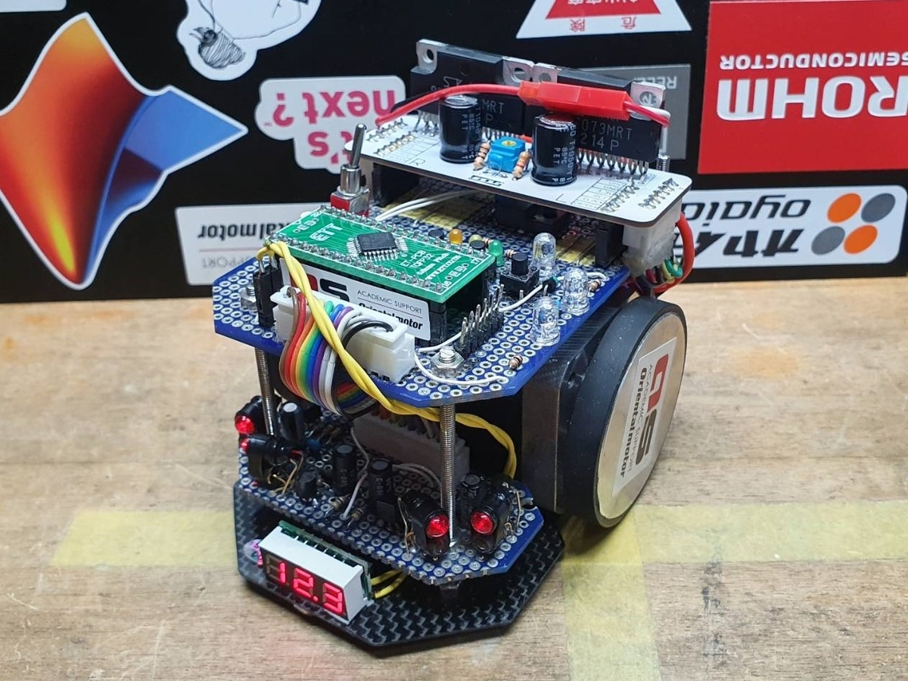
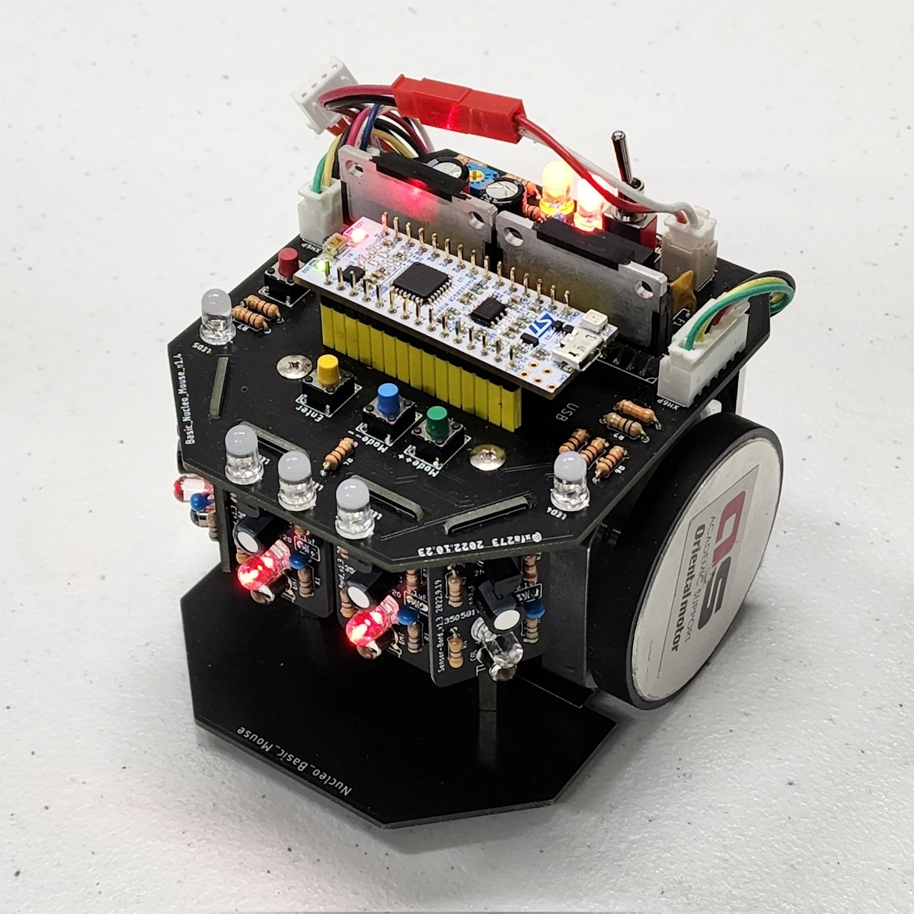
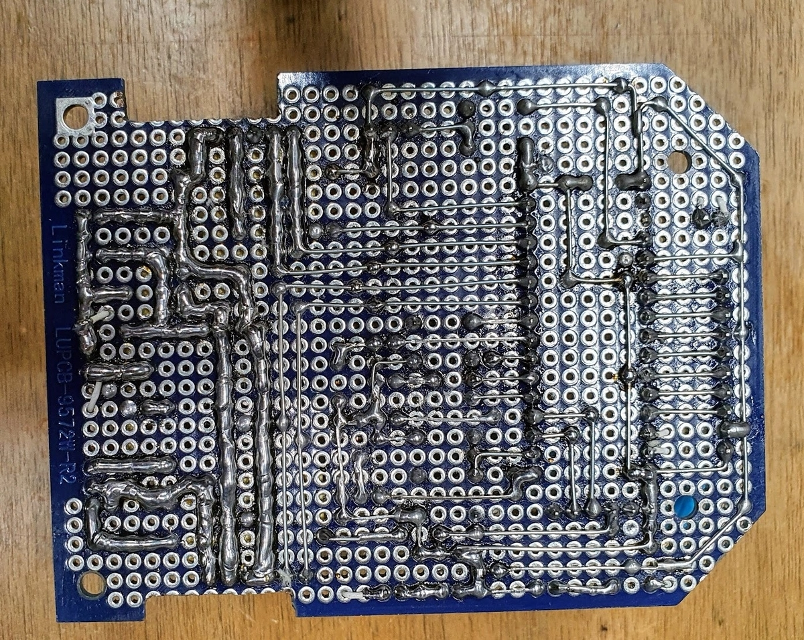
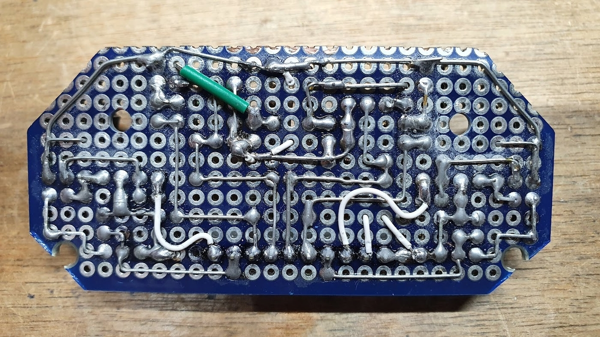
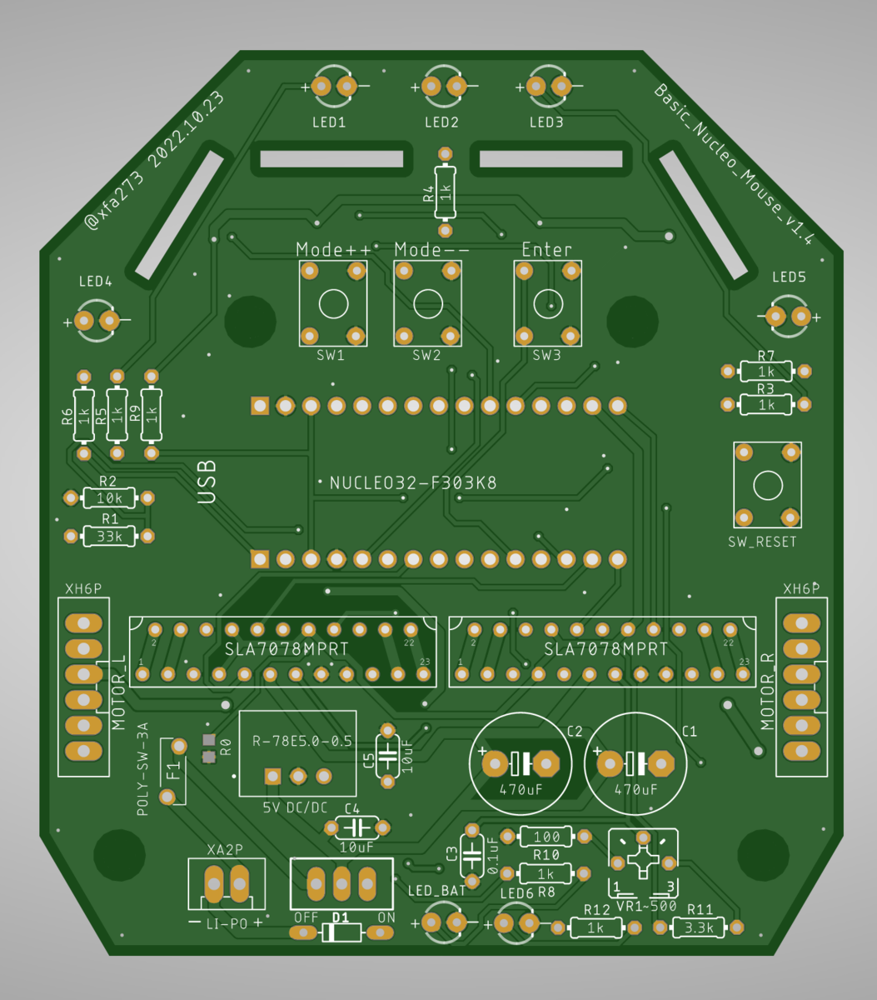
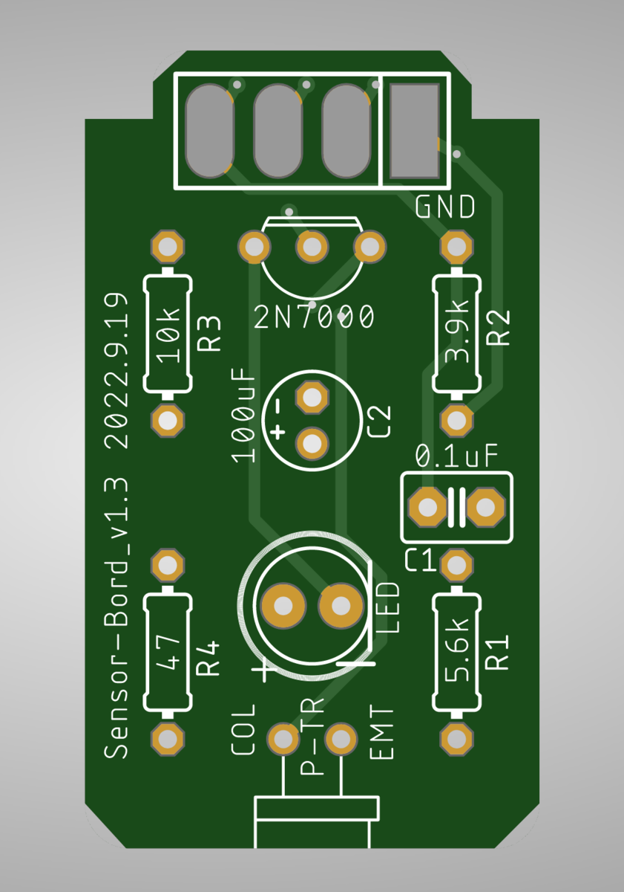

# 標準マウスのNucleo版を作ってみる ＜WMMCアドベントカレンダーDay15＞

これはWMMC AdventCalendar 2022

[adventar.org](https://adventar.org/calendars/7475)
の15日目の記事です．

### 0. お詫びとはじめに

本来[アドベントカレンダー](http://d.hatena.ne.jp/keyword/%A5%A2%A5%C9%A5%D9%A5%F3%A5%C8%A5%AB%A5%EC%A5%F3%A5%C0%A1%BC)は登録日になった瞬間に公開するもののようですが，この記事は登録日が終わろうとする今公開されます．遅くなって申し訳ありません...

昨日はjudgeさんの

[Ubuntu20.04でWeb面接環境を整える - judgeのブログ](https://judge.hatenadiary.com/entry/2022/12/14/001524)

でした．開発は[Ubuntu](http://d.hatena.ne.jp/keyword/Ubuntu)でやりたくても事務作業が不便なのはありがちな悩みなので，参考にしてみたいと思います．そういえば僕も最近[AirPods](http://d.hatena.ne.jp/keyword/AirPods) Pro 2を買いました，[スマホ](http://d.hatena.ne.jp/keyword/%A5%B9%A5%DE%A5%DB)は[Android](http://d.hatena.ne.jp/keyword/Android)なのに．ノイキャンも外音取り込みもマイクも優秀で，通話とかにも便利ですよね．

### 1. WMMCの標準マウスって意外と作るのキツい...？？

ご存知の通り？WMMCでは標準マウス ↓

が用意されていて，基本的に入会した人はまずこれを作って大会での完走を目指します．

モータドライバ基板のみプリント基板で，他はメイン基板とセンサ基板をユニバーサル基板で作ってケーブルで繋いでいます．
偉大な先輩方が設計しただけあって配線は割ときれいにまとまっていて交差も少なめですが，はんだ付け量はそれなりにあります．

自分は一応高校時代に多少ものづくり系の部活をやっていたこともあって3日ぐらいで動きましたが，1年生を見ている感じだとなかなか大変そうです．何かしらはんだ付けの経験があれば良いですが，未経験で不器用めな人だと配線が汚くてどこが悪いか永久に分からない全部が悪いんだよみたいな状態に陥りがちです．

それに，取り敢えず動いたとしても，はんだ付けや組み立ての汚い機体はセンサー値が不安定で制御しづらかったり真っ直ぐ走らなかったりと，大会完走へのハードルも高くなりがちです．

という訳で，昨日のjudgeさんも言ってましたが，最初はやはり機体が動いていて楽しくないと続かないので，もっと簡単な選択肢があっても良いかなと思ってプリント基板の標準マウスのような何かを作ってみましたています．

今回はこうして作ってみているプリント基板Nucleo標準っぽいマウスの紹介をしたいと思います．

↓ こういうやつです．

### 2. 簡単のための仕様を考える

WMMCの標準マウスの作るの大変ポイントは主に

・ユニバーサル基板のはんだ付けが難しい

・センサ基板は実装密度が高いのでなおさら難しい

・ケーブルが多いのでコネクタのカシメが難しい，特にセンサの10ピンXH

・底板と基板の固定に使うスペーサーが決まってないし穴位置が基板によって変わる

・センサのLEDとフォト[トランジスタ](http://d.hatena.ne.jp/keyword/%A5%C8%A5%E9%A5%F3%A5%B8%A5%B9%A5%BF)の光軸合わせが難しい，ズレやすい

あたりだと思います．僕は全然難しいと思ってなくてエアプなので他にもあったら教えて下さい．

ちなみに標準マウスの基板配線はこんな感じです ↓（センサ基板は一列ズレてるので注意）

これらを改善して出来るだけ大会完走までのハードルを下げるべく，以下のような仕様を考えました．

・全てプリント基板

・表面実装は無し

・カシメの必要なケーブルは最小限

・パーツ数が最小限

・センサの光軸合わせが簡単

・標準マウスとできるだけ同じ部品を使う

という感じです．究極的には誰が作ってもほとんど同じ性能が出るような機体にしたいですね．

### 3. 機体構成

これに従って具体的な構成を考えました．

#### メインボード

##### ＜[マイコン](http://d.hatena.ne.jp/keyword/%A5%DE%A5%A4%A5%B3%A5%F3)＞

標準マウスでは[マイコン](http://d.hatena.ne.jp/keyword/%A5%DE%A5%A4%A5%B3%A5%F3)として石のSTM32F303K8T6を使っていますが，配線量を減らすべくNucleo32ボードに変更します．書き込み用のコネクタやレギュレータの一部はボードに載ってるものを使えば楽なので．

##### ＜モタドラ＞

モータードライバは標準マウスと同じSLA7078MPRTを使い，配線も同じです．

##### ＜電源＞

電源は3.3VレギュレータはNucleoのものを使うことにして，5VのDC/DCコンバータで作った5VをNucleoの5Vピンに入れます．

つまりLi-Po 3S（12.6V）→5V DC/DC→Nucleoの5Vピン→Nucleoの3.3V LDO→[マイコン](http://d.hatena.ne.jp/keyword/%A5%DE%A5%A4%A5%B3%A5%F3)　って感じです．

これが謎に面倒で，ただNucleoの5Vピンに5Vを入れても電源として認識してもらえない（RGB LEDは光るけど動かない）ので，試行錯誤の結果リセットスイッチのプルアップを100Ωにすることで動くようになりました．何でやねん．

まあ取り敢えず5Vに普通の三端子レギュレータを使っている標準マウスよりは発熱を大きく抑えられているようなので良しとします．

あと，Li-PoのGND側（逆接したときの＋側）に[ダイオード](http://d.hatena.ne.jp/keyword/%A5%C0%A5%A4%A5%AA%A1%BC%A5%C9)を入れてるので，バッテリーを逆に挿しても死にませんなないはずです．いずれやってみます．

##### ＜インターフェース＞

基本的には標準マウスと同じで，3つのスイッチでモード選択をして，その状態を3つのLEDで3ビット表示します．ただしそれだけだと走行中にLED見て[デバッグ](http://d.hatena.ne.jp/keyword/%A5%C7%A5%D0%A5%C3%A5%B0)とかがしずらいので，自由に使えるLEDを2つ追加しています．

あと，どうでも良いこだわりポイントとして，LED周りのスペースを広めに取ってあるので，3mmでも5mmでも好きなLEDが使えます．（標準マウスは3mm限定）
個人的には輝度高めの先端スモークのLEDがおすすめです．←学生大会でMCさんに宇宙船っぽいって言われた

##### ＜その他こだわりポイント＞

・全ての素子の定数や極性をシルクで表示しているので多分なにも見ずにはんだ付けが出来る．

・パワーGNDとロジックGNDは分離して一箇所のジャンパで繋いでいる．ノイズ対策としてどれだけ有効かは知らんが...

#### センサボード

センサ周りの回路は標準マウスと全く同じですが，メイン基板の切り欠きに差し込んで直接はんだ付けするようにしました．

LEDとフォト[トランジスタ](http://d.hatena.ne.jp/keyword/%A5%C8%A5%E9%A5%F3%A5%B8%A5%B9%A5%BF)は基板に奥まで差し込んではんだ付けすれば勝手に基板に対して垂直になるし，基板自体の差し込みも1~2°程度の範囲でしか刺さらないので，取り敢えずぶっ刺してはんだ付けするだけで実用レベルの光軸調整ができます．

※横壁センサの角度は区画中心で柱を読む角度にしてます，それが無難ってどこかで見た気がするので．

#### 底板

標準マウスでは5mm厚のアクリル板をレーザーカットしたものを底板にしていますが，分厚いのと割れやすいのが難点です．←大会前に割ってる同期がいた

自分は呼吸器を犠牲にして0.8mm厚の[CFRP](http://d.hatena.ne.jp/keyword/CFRP)板を切って使いましたが，どう考えても他人には勧められる代物ではないでしょう．

という訳で配線のない虚無PCBで底板を作ることにしました．好きな形にできてシルクも入れられて5枚数ドルだし，ガラスエポキシ板なので頑丈です．

#### 組み立て

WMMCの標準マウスはモーターを強力両面テープで底板に貼り付けて底板と基板をスペーサーで繋ぐという手抜き構成になっている（Miceのステッパーはちゃんとマウント使ってて関心した）ので，これを継承します．

ただし，その辺に転がってるスペーサーを適当に組み合わせて長さを調整するのは💩なので，長さぴったりで千石で売っている53mmのスペーサーを指定しました．

メイン基板とセンサ基板は繋がっているので，底板とメイン基板をスペーサーでとめればそれだけでOKです．

### 4. 取り敢えず出来上がった機体

これを実際に作った機体がこちら↓．

> ブログ用 [pic.twitter.com/OQFmwUzErj](https://t.co/OQFmwUzErj)
>
> — XFA-27 (@xfa273) [2022年12月15日](https://twitter.com/xfa273/status/1603397249056358404?ref_src=twsrc%5Etfw)

まあおおかた思った通りに出来上がりました．狙い通りはんだ付けも簡単で，自分はそこそこ丁寧にやって1.5時間ぐらいで終わりました．部品買い揃えながらだったのでかかった時間は不明ですが，材料が全て揃っていれば3時間ぐらいで完成すると思います．

学生大会前日に1年生に作ってみてもらったのですが，製作開始からそれなりに迷路を走るようになるまでちょうど（作業時間で）12時間でした．調整不足もあって残念ながら大会では完走できませんでしたが，学生会館の小さな迷路ではゴールまで走れていたので，もう数時間調整できれば...って感じでした．←そもそも前日に作り始める方が問題

↓ 2台並んだ記念写真的ななにか

> 後輩にNucleoステッパーを投げ付けて10時間で作ってもらった
> WMMCお馴染みの前日完成機体です [pic.twitter.com/4V8HDfkVXN](https://t.co/4V8HDfkVXN)
>
> — XFA-27 (@xfa273) [2022年11月26日](https://twitter.com/xfa273/status/1596494327072854017?ref_src=twsrc%5Etfw)

自分が作った機体は一応[スラローム](http://d.hatena.ne.jp/keyword/%A5%B9%A5%E9%A5%ED%A1%BC%A5%E0)と直線加速を使った最短走行まで成功し，学生大会では

> マイクロマウス学生大会2022
> クラシックマウス ”Rat-Run\_prototype”
> 17秒783で9位でした
> 無事ポイント持ちになれてるので、全日本には本命のDCモーター機を出せるように頑張りたいと思います… [pic.twitter.com/w0xwFJb3Ev](https://t.co/w0xwFJb3Ev)
>
> — XFA-27 (@xfa273) [2022年11月29日](https://twitter.com/xfa273/status/1597660247535280128?ref_src=twsrc%5Etfw)

という成績でした．1年生の全日本の時より遅いパラメータなので微妙ですが，まあ入門機としてはこのぐらい走れば問題ないでしょう．もっと速くしたい人は[スラローム](http://d.hatena.ne.jp/keyword/%A5%B9%A5%E9%A5%ED%A1%BC%A5%E0)の生成頑張るかオリジナルハード作ってくれ．

### 5. 既知の問題点と改良ポイント

・Nucleoの謎にGPIOピンが2つ繋がっている仕様を回避すべくNucleo裏のジャンパ抵抗を外す必要がある．

せっかく初心者に優しく表面実装無しにしているのに表面実装剥がさなきゃいけないのはどうなの...って気がするのでピン[アサイ](http://d.hatena.ne.jp/keyword/%A5%A2%A5%B5%A5%A4)ン見直して回避しようと思います．

・モータドライバのEnableピンがHighで励磁OFF，Lowで励磁ONの仕様なので，[マイコン](http://d.hatena.ne.jp/keyword/%A5%DE%A5%A4%A5%B3%A5%F3)が動作していない時にモーターが励磁してしまう．

標準マウスも同じくですが，[マイコン](http://d.hatena.ne.jp/keyword/%A5%DE%A5%A4%A5%B3%A5%F3)に書き込んでいる間やリセットボタン押した直後に無駄に励磁してしまいます．致命的ではないですがあまり気持ち良くないので，Enableピンをプルアップしたら直るんじゃないかな...多分...

・Li-Poバッテリーからの電源コネクタがXAなので変換ケーブルが必要．

面倒臭いし逆接しそうで危ないので，基板用のXT30を生やす方が良い気がしてますが，WMMC標準マウスとの互換性とどっちをとるか悩みどころ．

・基板のシルクが微妙に間違っている．

モーターのXHコネクタの向きが逆だったり100Ωが1kΩになってるところがあったりする．早く直せ．

### 6. おわりに

こんな感じで簡単に作れる標準マウスっぽい機体を作ってるよという話でした．先ほど問題点を挙げたようにもう少し改良してそれなりに満足いく機体になったら，WMMCの新入生が作る機体として標準マウスの他に第二の選択肢として出せるようにしたいと思っています．

CADやパーツリスト，組み立て手順なども追々ブログやサークル[Wiki](http://d.hatena.ne.jp/keyword/Wiki)で公開する予定です．

プロトタイプ状態でも良いから作ってみたいという人がいれば声かけてください，多少は基板の余りがあるので．

僕自身はもうステッパーを作ってる場合じゃなくてDC機を走らせろという状態ですが，残念ながら研究がクソ忙しくなってて全日本までにはなかなか厳しそうです．夏までサボってただけなので完全に自己責任であって弊研究室がブラックとかでは決してありません，誤解なきよう．

登録日が終わるギリギリでの投稿になってしまい申し訳ないですが，ここまでお読みいただいた方ありがとうございます．

明日（といっても数分後）の記事はぱわぷろさんの「開発するのは人かチームかロボットか？ ～セルフ開発マネジメント～」です．
僕は[脊髄反射](http://d.hatena.ne.jp/keyword/%C0%D4%BF%F1%C8%BF%BC%CD)でしかモノを作れないのでそういう事ちゃんと考えてるの流石過ぎますね，楽しみです．
