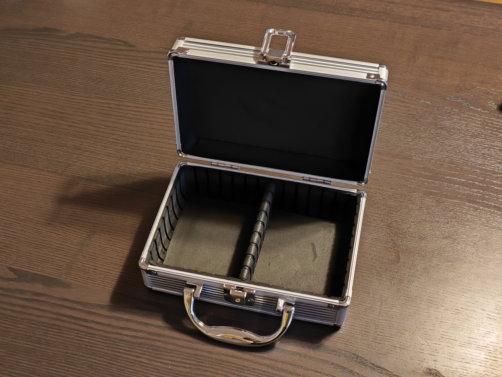
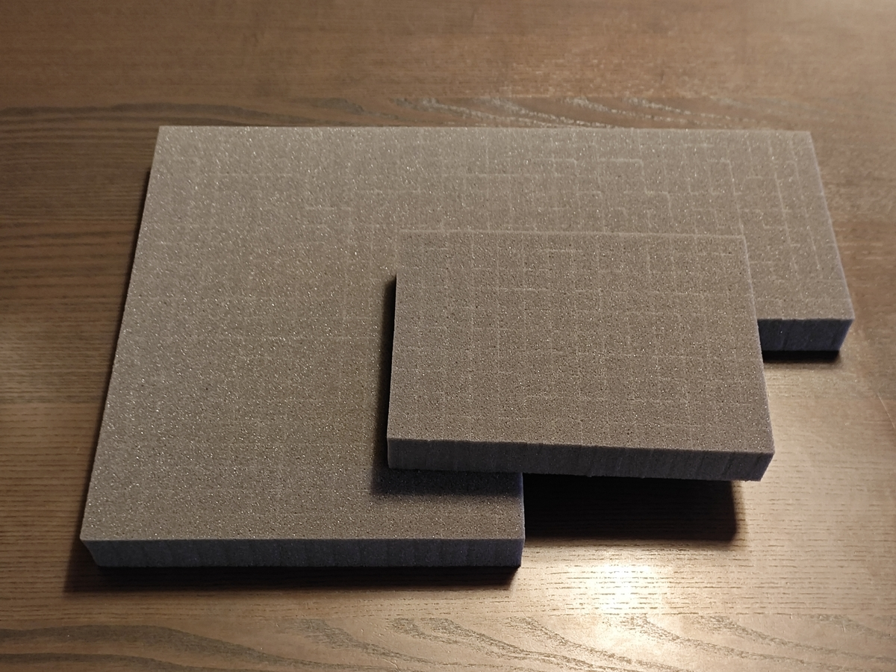
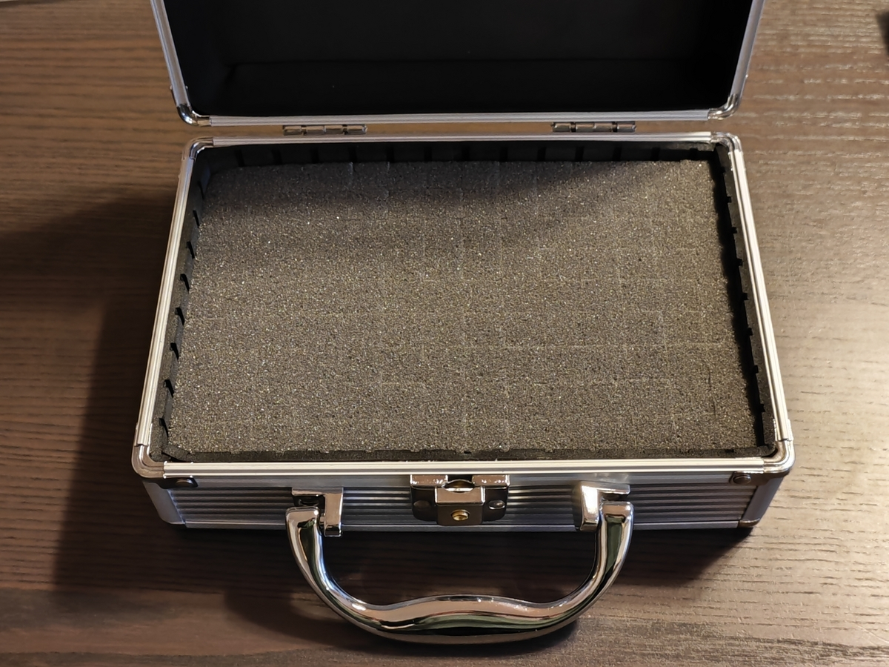
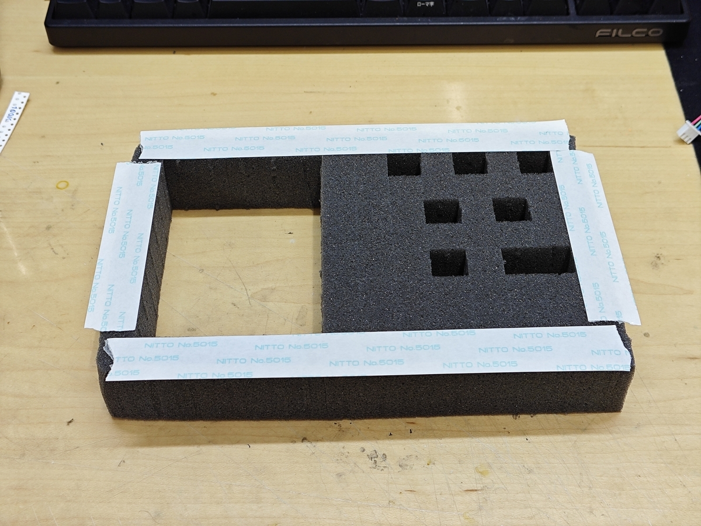
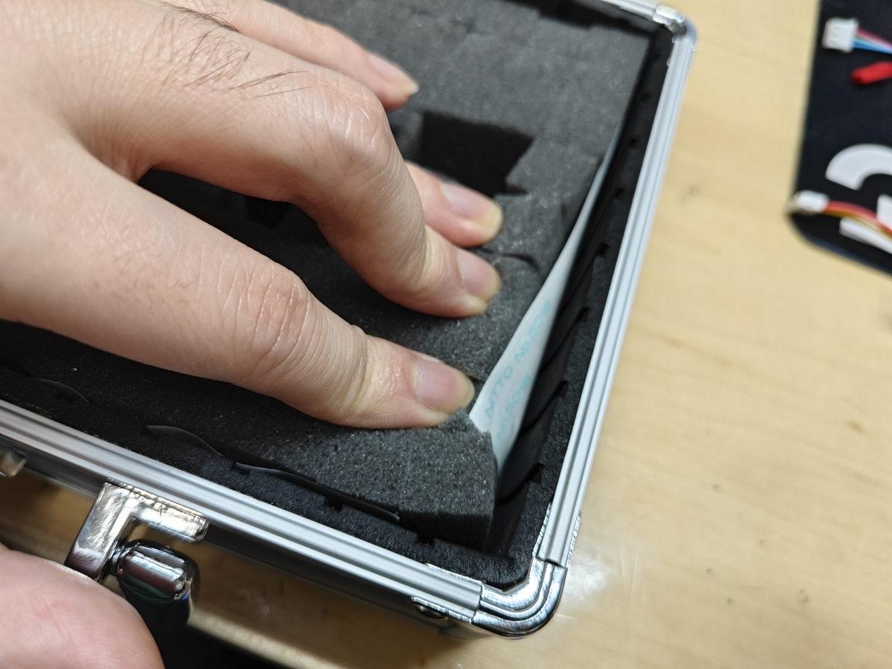
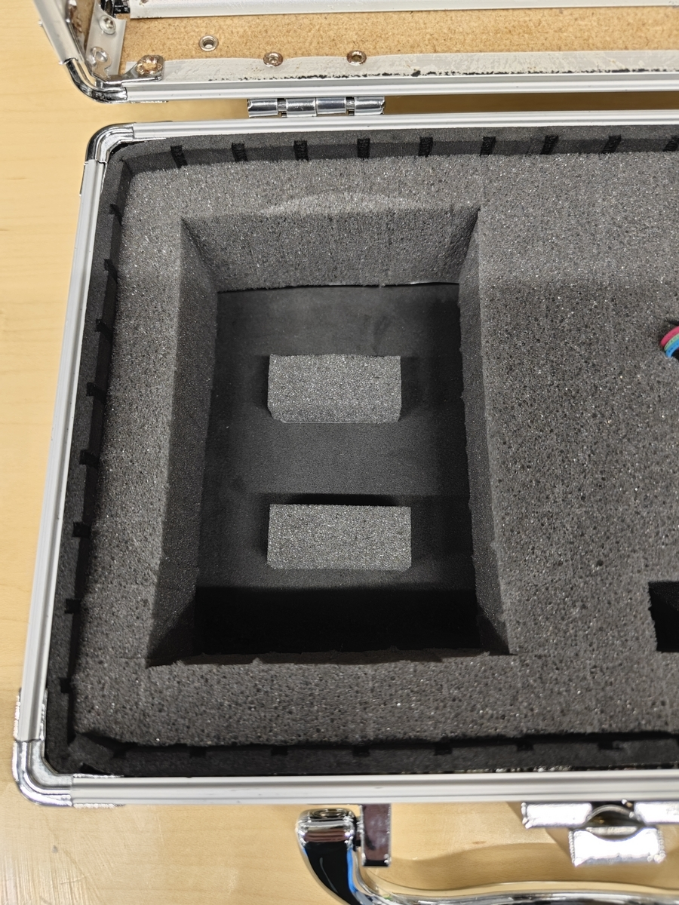
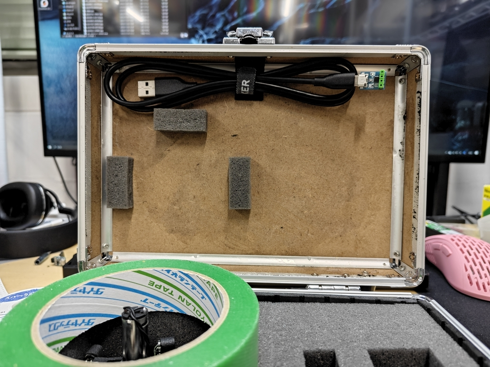
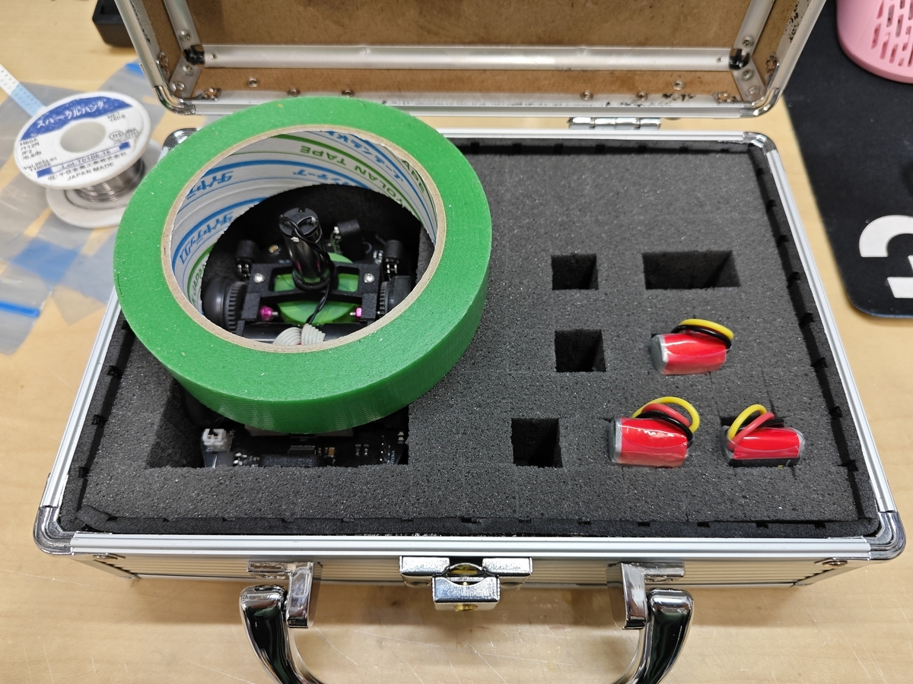

# マイクロマウスを持ち運ぶケースを作る

昨年のアドベントカレンダーからブログを放置していました，XFA-27です．学生大会前日につき調整をしていましたが，突如として妖怪ピニオン滑りが発生したのでメタルロックが固まる間にこの記事を書いています．

吸引モーターを変更したら吸引力がめちゃくちゃ上がって数秒なら1.1kgぐらい吸えるようになりました（その後モーターが焼けた）が，ソフトその他がクソ雑魚なので全く活用できていません．何ならこの前の東日本大会より遅くなりそう...

それはそうと

これは[WMMC Advent Calendar](https://adventar.org/calendars/8818) 2023の8日目の記事です．

昨日は[ぱわぷろ@ラボ](https://adventar.org/users/26315)さんの[ETロボコンの紹介](https://ss-sholaw-wmmc.hatenablog.com/entry/2023/12/07/010408)でした．共通ハードを使ってソフトウェアの内容を競うロボコンだそうで，ハード性能でどうにかしようとしがちな僕がやるべきものな気もします．

### マイクロマウスの運び方

マイクロマウスの機体は自宅とサークルの活動場所，そして大会会場などの間で持ち運ぶ必要がありますが，それなりに精密なロボットなので雑にカバンに放り込むと壊れたり調整が狂ったりします．

そこで多くの人はちょうど良い大きさの容器を探して機体ケースとして使っているんじゃないでしょうか．100均で売っているケース（多分DVD用）やタッパー，弁当箱などをよく見かけますが，今回はもう少し頑張って，機体や周辺機器をぴったり仕舞えるケースを作ってみました．まあ大会で割と見かけるやつなので新規性はないですが，記事としては見当たらなかったので一応書いておこうかなと．そもそも今日はカレンダー埋めるのが主目的だし．

### やりたいこと

機体を持ち運ぶケースに欲しい機能は
・それなりに頑丈で，ケース単体で持ち運べる
・機体と周辺機器（バッテリー，書き込みケーブル，ホコリ取り用のテープ）が入る
・ケース内で機体などが動かない
辺りだと思います．これを満たせるケースを作っていきます．

### 買ったもの

Amazonで売っていた安くて小さな[アルミ製のケース](https://amzn.asia/d/a2t0N32)と良い感じに[切れ込みの入ったスポンジのブロック](https://amzn.asia/d/eOwklc7)を買いました．ブラックフライデーの割引込みで計2700円ほど．雑に検索して雰囲気で選んだのでもっと良いものがあるかもしれませんが...

### 作り方

アルミケースには内側に緩衝材が貼ってあり中央に仕切りが入っていますが，今回は内側にスポンジブロックを詰めるので仕切りは外しておきます．

まずケースの内寸を測って，ぴったりか少し大きいぐらいにスポンジブロックを切って，ケースにはめ込みます．スポンジブロックはカッターナイフで簡単に切れます．

次に，スポンジブロックの内側に機体や周辺機器がぴったりはまる大きさの切り欠きを作ります．スポンジブロックには10mm刻みぐらいの切れ込みが入っているので，これを指でちぎり取れば簡単に切り欠きを作ることができます．

それができたら，一旦スポンジブロックをケースから外し，スポンジブロックの底面・側面に両面テープを貼ってからケースに戻します．これでスポンジブロックがケースに固定されます．

最後に，機体などの高さに合わせて底面にスポンジ辺を貼り付けて調整します．このスポンジ辺は切り欠きを作るためにちぎり取って出たものが使えますし，サイズが合わなければ余りのスポンジブロックから切り出します．

これで基本的には完成ですが，フタ側にスペースの余裕があれば，マジックテープを貼っておけばケーブルのタイ部分にくっつけて固定できて便利です．また，スポンジブロックとフタの隙間の高さを調整すれば，テープを入れたときに中で動かなくなるので，これも便利です．各々の入れたいものと機体のサイズに合わせてうまく調整すると良いでしょう．写真の例では，マジックテープを貼るのに邪魔だったのでフタ側の緩衝材は剥がしていますが，あまり見た目が良くないですね...

### まとめ

小さなアルミケースと切込み入りスポンジブロックの組み合わせで良い感じのマイクロマウス用キャリングケースが作れました．アルミではなく樹脂製のケースも売っているので，軽くしたい人はそっちの方が良いかもしれません．
走行中のクラッシュが原因ならともかく，輸送や保管で無駄に機体を壊すと開発が滞ったりモチベが蒸発したりするので，ちょうど良いケースを用意して防げると良いのかなぁと思います．

明日は[T-MPI 電気しらたき](https://adventar.org/users/59361) 君の「アドベントカレンダーなんもわからん」です．お楽しみに．
