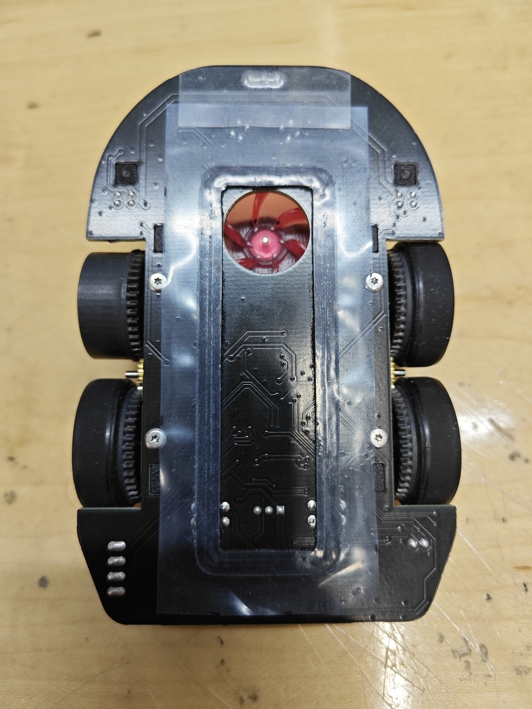
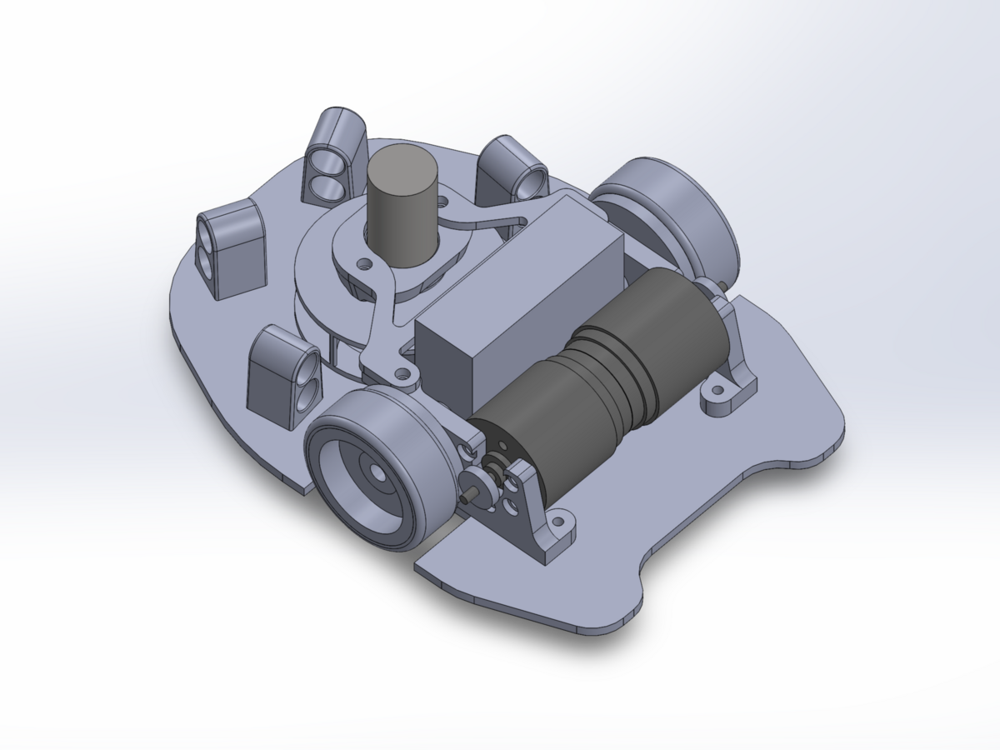

# クラシックマウス "Ca.161/bis" の紹介

- 公開日（移行元）: `2023-12-19`
- 移行元記事: https://xfa273-backofchirashi.hatenablog.com/entry/2023/12/19/151923

これは WMMC Advent Calendar 2023 の18日目の記事です．

- Advent Calendar: https://adventar.org/calendars/8818

## 今シーズンのクラシックマウス機体 "Ca.161/Ca.161bis"

今シーズンの機体紹介として，主にDCマウス初心者向けにまとめています．この機体は4年前に設計開始し，2年前に概ね完成，今年の金沢草の根大会で初完走しました．課題は多いものの，東日本大会で10秒切りを出すなど，実戦レベルまで到達した機体です．

**Ca.161/Ca.161bis 機体写真1**

**Ca.161/Ca.161bis 機体写真2**

機体名はイタリアの高高度飛行記録機に由来します．同一設計でマイナーチェンジを重ねて3機製作し，2機目に `bis` を付けています．

- 回路図データ: https://1drv.ms/f/s!AgXszzZBYLWdjKhRNae3KDVNX6MVyA?e=vSdF8I

## 設計思想的なもの

回路は先輩機（「ぐでたまうす」「道標 現」）の良い部分を取り込み，ソフトはサークル標準機体を可能な限り流用する方針で設計しました．

当時の改善ポイントとしては以下を重視しています．

- 横壁に当たっても引っかかりにくい機体形状
- 前壁接触で姿勢補正しやすい構造
- 吸引力の確保（ファン径・ファン穴径）
- センサを飽和しにくい無難な配置

## 各機能について

### マイコン周り

STM32F405を中心に，サンプル回路に準拠した堅実な構成です．初心者段階ではピーク性能よりも，開発を止めない無難な部品選定が重要という考えです．

**マイコン周辺回路**

### 電源周り

`Li-Po 2S -> LD1117 5V -> NJM2884 3.3V` の構成で，サイズと入手性，電流余裕を重視して選定しています．

**電源回路**

### センサ

フォトトランジスタ `L-51ROPT1D1`，赤外線LED `OSI5LA5113A` を使用．機体組み込み後に分圧抵抗を調整して，壁距離に対するAD値を実用域へ合わせています．

**センサ回路**

### IMU

`ICM-20689` を採用．側面パッド実装で難易度はありますが，フラックスを多めに使えば実装可能です．

**IMU回路**

### モータ周り

配線性のためにコネクタのピンアサインを調整しています．初回動作確認時はモータ電源を5Vに落として確認する運用が安全です．

**モータ駆動回路**

### インターフェイス周り

UARTは秋月のFT234X変換基板を直接挿せる構成．吸引ファンは大電流対応のFETを使い，熱余裕を確保しています．

**インターフェイス回路**

### 吸引

直径31mm，高さ8mmのファンを採用．実用はDuty50%付近（吸引力500g程度）で運用し，スカートは一次/二次の二層構成です．

**吸引ファン**

**スカート構成**

### 足回り

4輪構成ですが，モータマウント設計の影響で左右ターン差が発生し，この機体の調整難易度が上がりました．

**足回り**

当時の反省点:

- モータ保持部の剛性不足
- マウント間を繋ぐ構造不足
- 車軸固定方法の再現性不足
- 樹脂ギヤホイール精度のばらつき

## 新作について

Ca.161bis の課題を受けて，次機体では2輪化，アルミ切削モータマウント，PCBファンマウントを採用予定としていました．

**新作 Nightfall のイメージ1**

**新作 Nightfall のイメージ2**

機体名は `Nightfall`．アーマード・コアVI由来で，先輩機体「道標 暁」と名前の対比になっているのが面白いポイントです．
