# クラシックマウス"Ca.161/bis”の紹介

これは[WMMC Advent Calendar 2023](https://adventar.org/calendars/8818)の18日目の記事です．

しかしダラダラしてたら日付が変わってしまいました，ごめんなさい...

昨日は卓輝君の[「ある大阪人のはじめて料理奮闘記」](https://92388gtakkgxmkk12sgmmd.hatenablog.com/entry/2023/12/18/001359?_gl=1*i2alzh*_gcl_au*MTExOTUwMzQyMC4xNzAyODI0MTEy)でした．後半の料理はちゃんと料理になっていて，成長が感じられますね．僕は実家暮らしなので偉そうなことは何も言えませんが，レンチンでパスタ茹でてペペロンチーノとか，豚肉と野菜を炒めて焼肉のタレorミックススパイスとかが楽でやりがちです．

今日明日は太郎君の[「悩める貴方様に」](https://jitsuhataro.hatenablog.com/entry/2023/12/18/235834)です．哲学っぽい本が何冊か紹介されています．最近は技術系と[Twitter](https://d.hatena.ne.jp/keyword/Twitter)以外の文章を全く読まなくなってしまったので，見習って何か読もうかと一瞬思いました．

### 今シーズンのクラシックマウス機体 "Ca.161/Ca.161bis"

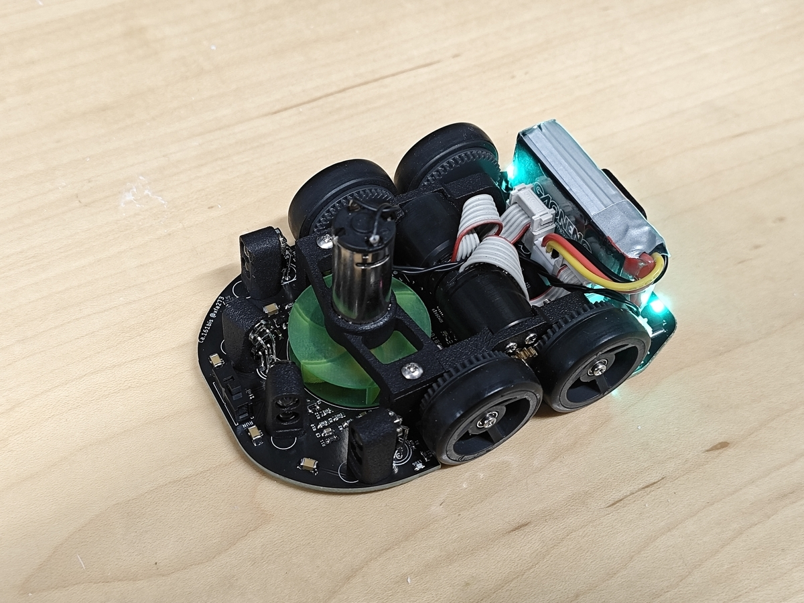

さて，今回は今シーズンの僕のマウスについて紹介して，主にDCマウス初心者の参考になればなぁという記事です．この機体は4年前に設計を始めて2年前におおよそ完成し，今年の金沢草の根大会で初めて完走しました．色々課題はあるものの，僕にとって初めてのDCマウスで，東日本大会では10秒切りのタイムを出すなどそれなりに走るようにはなったかなという印象です．

機体名の由来はイタリアの高高度飛行記録を持つ飛行機で，マウサーは宇宙を目指す習性があるのでその一歩として，という意味で付けました．が，そういうレベルでマウスをやると辛いだけな気がしてきたので，もう二度とこんな名前は付けません...

基本設計は同じままマイナーチェンジで3機作ったので，2機目は「改良型」を意味する「bis」を付け，3機目はネーミング切れでそのままです．9~11月で3台作ったので月イチのペースで機体を作っていて，12月は新機体を作っているので，未だそのペースを維持しています．（流石にもうやりたくない）

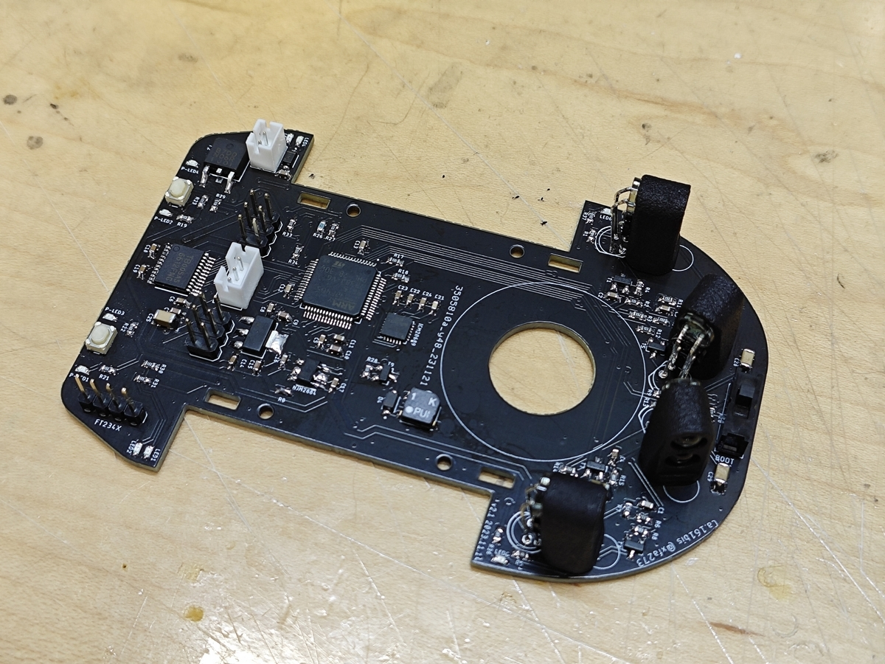

[回路図データ](https://1drv.ms/f/s!AgXszzZBYLWdjKhRNae3KDVNX6MVyA?e=vSdF8I)

### 設計思想的なもの

回路は先輩の機体（"[ぐでたま](https://d.hatena.ne.jp/keyword/%A4%B0%A4%C7%A4%BF%A4%DE)うす"と"道標 現"），ソフトはサークル標準機体からできるだけ流用して，ハードだけ強い人のを真似て手っ取り早く速い機体にしたいという安易で考えで設計しました．速い人の中でも比較的オーソドックスな4輪吸引機としてなおフィスさん，そらさんの機体を意識していた気がします．

それと，当時近くで見ていた先輩の機体の難点だと思った点を改良しようと思って
・横壁に当たっても引っかかりにくく前壁に当たると姿勢が補正される機体形状
・吸引力の確保（ファン径とファン穴径を大きく取る）
・センサ配置は無難でシンプルなもので，壁に[接触](https://d.hatena.ne.jp/keyword/%C0%DC%BF%A8)するまで飽和しない位置
を意識しました．これは概ね間違っていなかったと思います．

### 各機能について

#### [マイコン](https://d.hatena.ne.jp/keyword/%A5%DE%A5%A4%A5%B3%A5%F3)周り

「[ぐでたま](https://d.hatena.ne.jp/keyword/%A4%B0%A4%C7%A4%BF%A4%DE)うす」のほぼ丸パクリ．STM32F405のデータシートのサンプル回路準拠だったと思います．[マイコン](https://d.hatena.ne.jp/keyword/%A5%DE%A5%A4%A5%B3%A5%F3)選定もみんな使ってて無難そうだから．始めのうちは[マイコン](https://d.hatena.ne.jp/keyword/%A5%DE%A5%A4%A5%B3%A5%F3)の性能差で差が出ることなんてないので，とにかく引っかからずに開発が進みそうな無難部品選定がおすすめです．先輩と合わせる，サークル標準機体と合わせる，Pi:CoやHM-Starterと合わせる，など．

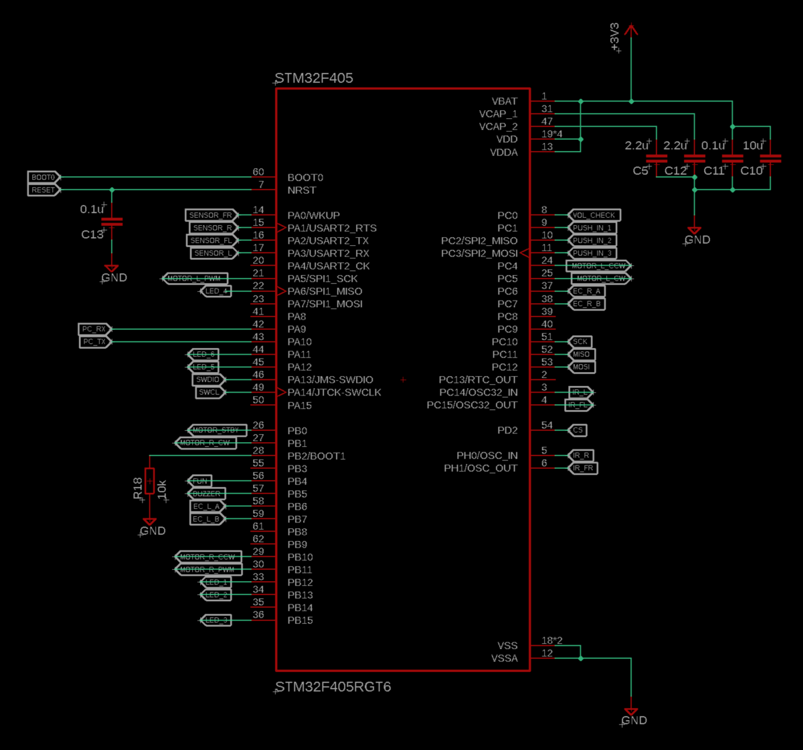

#### 電源周り

ここはオリジナル選定．Li-Po 2S → [LD1117](https://akizukidenshi.com/catalog/g/gI-15255/) 5V/800mA → [NJM2884](https://akizukidenshi.com/catalog/g/gI-10673/) 3.3V/500mAh で，秋月で買えてサイズが小さめで電流に余裕があるものを選びました．高輝度LEDをビッカビカに光らせても問題なく，電源関係のトラブルは全くありませんでしたが，発熱は結構あります．

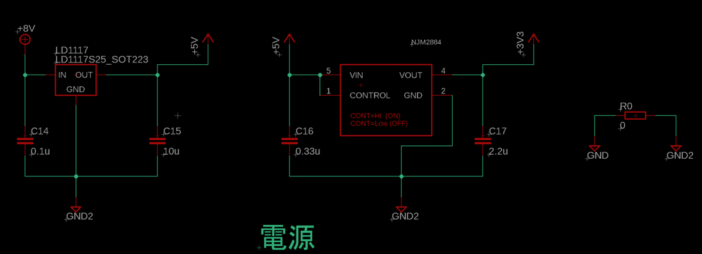

#### センサ

サークル標準機体とほとんど同じ．フォト[トランジスタ](https://d.hatena.ne.jp/keyword/%A5%C8%A5%E9%A5%F3%A5%B8%A5%B9%A5%BF)が[L-51ROPT1D1](https://akizukidenshi.com/catalog/g/gI-04211/)，赤外線LEDが[OSI5LA5113A](https://akizukidenshi.com/catalog/g/gI-12612/)で，どちらも秋月で売っているものです．センサの個体差のためか特性がイマイチだったので機体に組み込んでから分圧部分の抵抗値を変更して調整したら良い感じになりました．AD値は壁2枚先で300程度，壁1枚先で1500程度，壁に[接触](https://d.hatena.ne.jp/keyword/%C0%DC%BF%A8)した状態で3500程度．

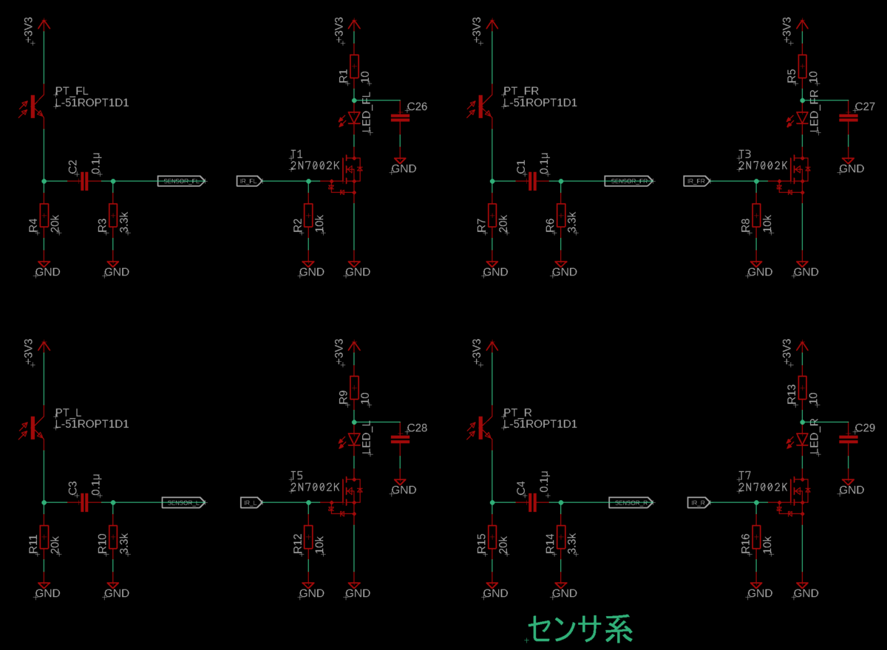

センサの配置は，機体が柱の位置にいるとき横壁の区画中央が見える位置と角度．前壁センサに角度付けて斜め壁制御するやつはまだやってないので分からん．

#### IMU

ICM-20689をデータシートのサンプル回路通りに使いました．このIMUはフィルタが内蔵されているとかで初心者にも使いやすいみたいです．側面パッドなのではんだ付けは難しいものの，細めのコテ先でフラックスをたっぷり使えば普通に付けられると思います．

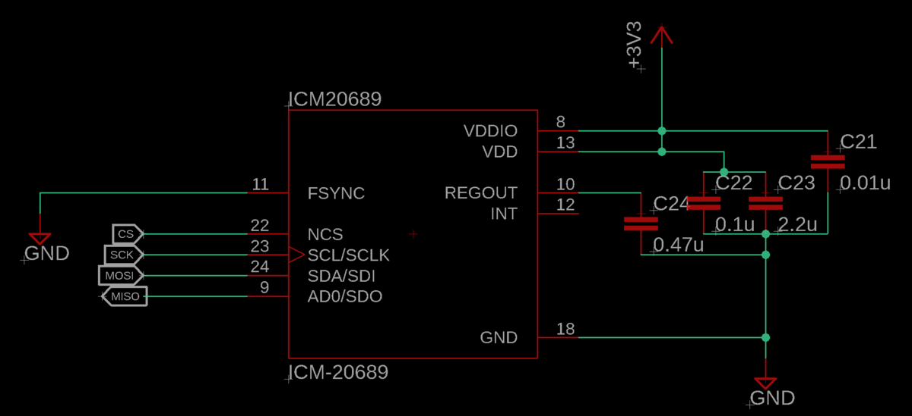

#### モータ周り

これもデータシート準拠．配線しやすくするためにモータのコネクタのピン[アサイ](https://d.hatena.ne.jp/keyword/%A5%A2%A5%B5%A5%A4)ンを変更しています．ミスるとエンコーダを焼くので，最初の動作確認のときにはモータ電源を5Vにしておけば安心です．

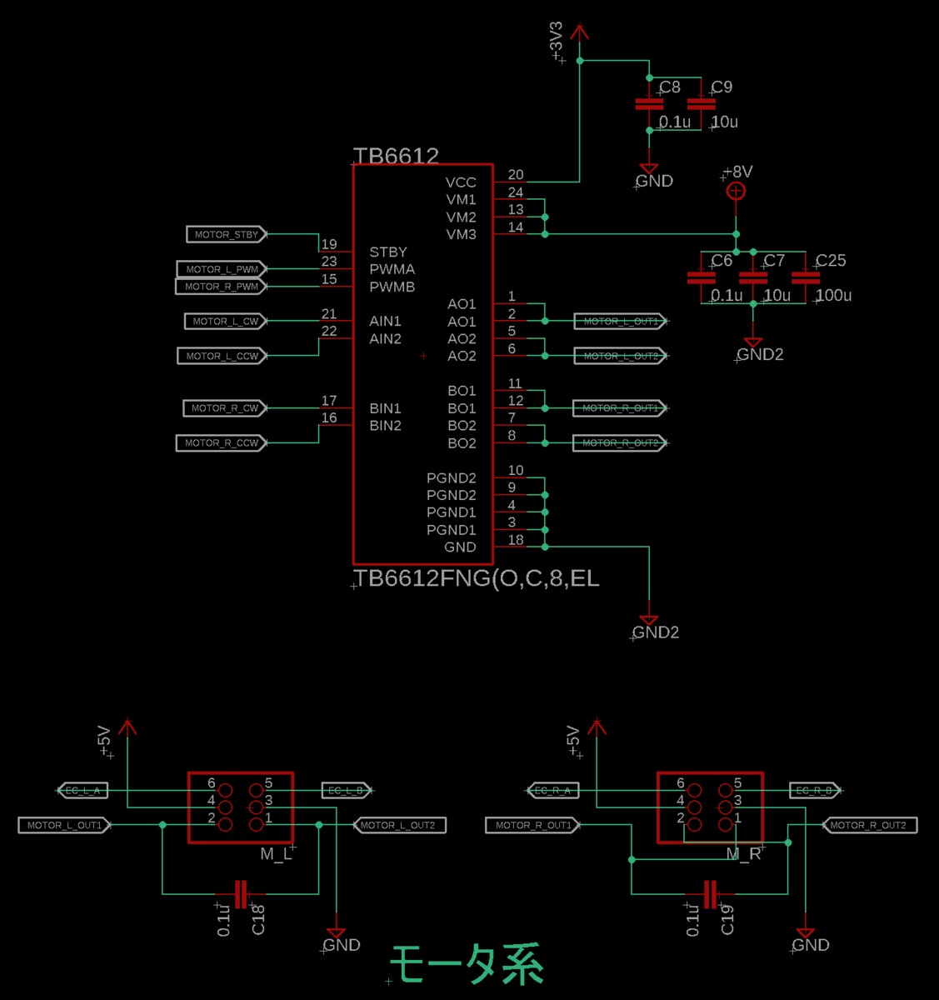

#### [インターフェイス](https://d.hatena.ne.jp/keyword/%A5%A4%A5%F3%A5%BF%A1%BC%A5%D5%A5%A7%A5%A4%A5%B9)周り

LEDとかスイッチとか．UARTは秋月のFT234Xシリアル変換基板をそのまま挿せるようにしています．ST-LINKは省いてしまったのでデバッガは使えません．分圧は1/3なので一応3セル対応．

回路的にほぼ同じなのでまとめちゃってますが，ブザーと吸引ファンはFETでスイッチング．吸引ファンは数A流れて発熱がすごいので，[TO-252の大きめのもの](https://akizukidenshi.com/catalog/g/gI-17191/)にしました．これならモータが焼け死ぬまで回してもFETは無傷です．

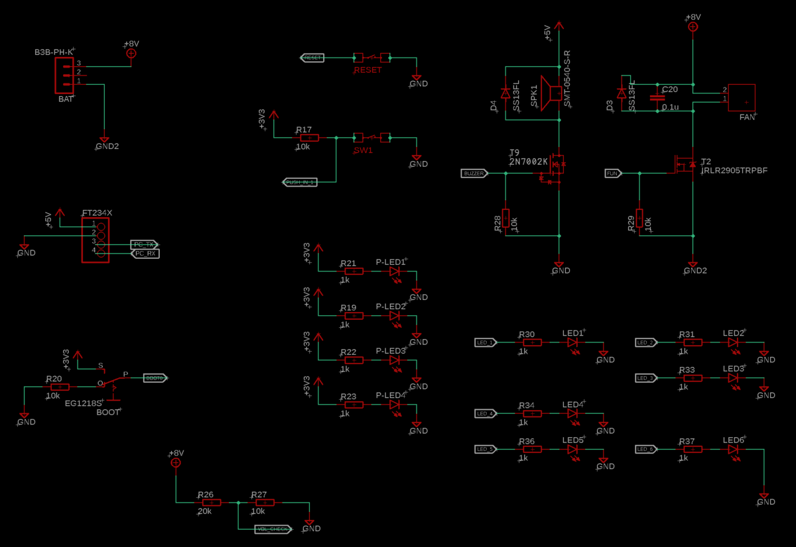

#### 吸引

ファンは雰囲気設計で直径31mm，高さ8mm．モータは[アリエクで買った1020コアレス](https://ja.aliexpress.com/item/1005004925984006.html?spm=a2g0o.order_list.order_list_main.34.3597585adCZK6r&amp;gatewayAdapt=glo2jpn)で，Duty100%だと吸引力1.1kg出るものの5秒で焼け死ぬので実用はDuty50% 吸引力500gぐらいまで．それでもかなり吸える方みたいですね．

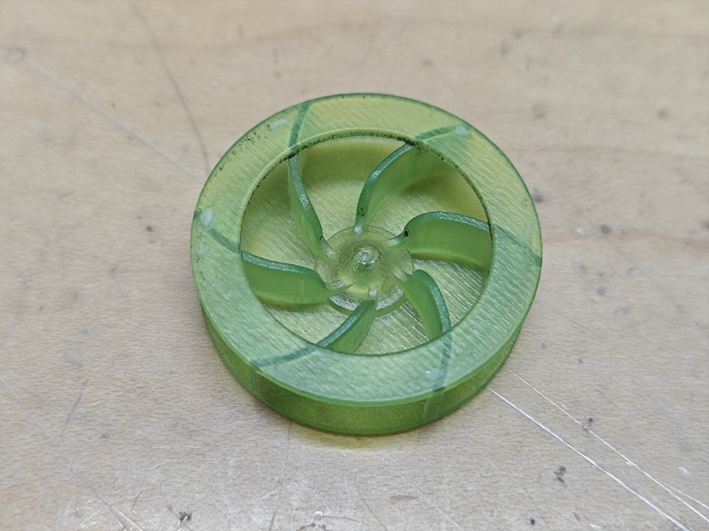

スカートは[あささんの機体](http://haido.blog.jp/archives/1076453798.html)を参考に一次スカートが3Dプリント製の枠，二次スカートが秋月の[青チャック袋](https://akizukidenshi.com/catalog/g/gP-01955/)．地上高2.5mmぐらいで一次スカート0.8mmですが，非吸引時に路面に擦らず吸引抜けもなさそうなので割と上手くできたと思います．

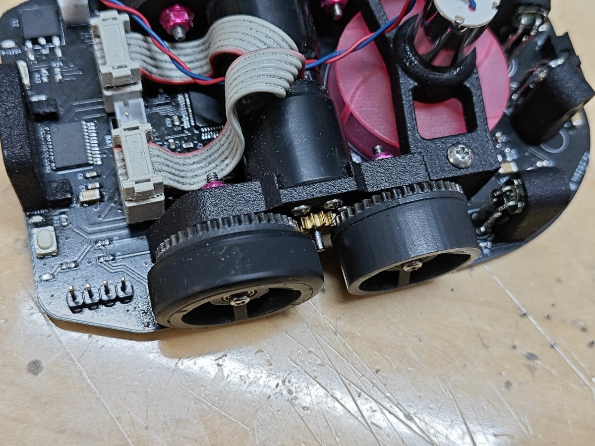

#### 足回り

構成は無難な4輪ですが，モータマウントの設計が悪くてどうにもターンが左右で違ってしまいます．これに発狂してこの機体は放棄，新機体作成になった訳ですが，考えられる要因はこんな感じ．
・モータマウントのモーターはめ込む部分が薄すぎて変形しやすい．
・吸引ファンマウントはモータマウントを広げる方向に力をかけるが，機体後部にはモータマウントどうしを繋ぐ部材がないので，モータマウントが傾く．
・車軸の位置決めのためにモータマウントの穴をキツめにしたが，このせいで軸のネジをねじ込む状態になり，ねじ込み具合によって車軸に角度がつく．
・光造形3Dプリント製のギヤホイールが微妙に精度が悪く，僅かに傾いているものがある．

新作ではアルミ切削のモータマウントを使うことでこの問題をおおかた回避する予定．樹脂3Dプリントでもちゃんと走ってる人もいるので上手い作り方はそういう人に聞いて...

その他

それ意外で気にしたことはこんな感じ．
・バッテリーの搭載位置を設計段階で決めて，ホルダー的なものをつける．
・LEDの色とファンの色を揃えて統一感を出す．（学生大会verではファン変更により失敗）
・ケーブル長を最低限にする．（1717のケーブルがぐるぐる巻なの格好悪いよね，切ると不可逆要素になるので悩みどころだけど）

### 新作について

この前の記事でも触れましたが，Ca.161bisは足回りの問題のためにターン調整が困難なので，全日本大会に向けて新作を作っています．回路は全く同じで足回りを2輪に変更，モータマウントをアルミ切削でファンマウントをPCBで作成する予定です．部品は全て発注済なので早ければ年内には組み立てられると思います．

設計開始→発注終了まで4日でやったので何かしらミスってそう...

機体名は"Nightfall"，由来は今年ハマったゲームの[アーマード・コア](https://d.hatena.ne.jp/keyword/%A5%A2%A1%BC%A5%DE%A1%BC%A5%C9%A1%A6%A5%B3%A5%A2)Ⅵに登場する機体から．サークルの先輩にして旧機体のパクり元のぱわぷろさんも似たような構成の2輪吸引機"道標 暁"を作っていて，暁とNightfall（夕暮れ）が対っぽいことに気づきました，狙った訳ではない．

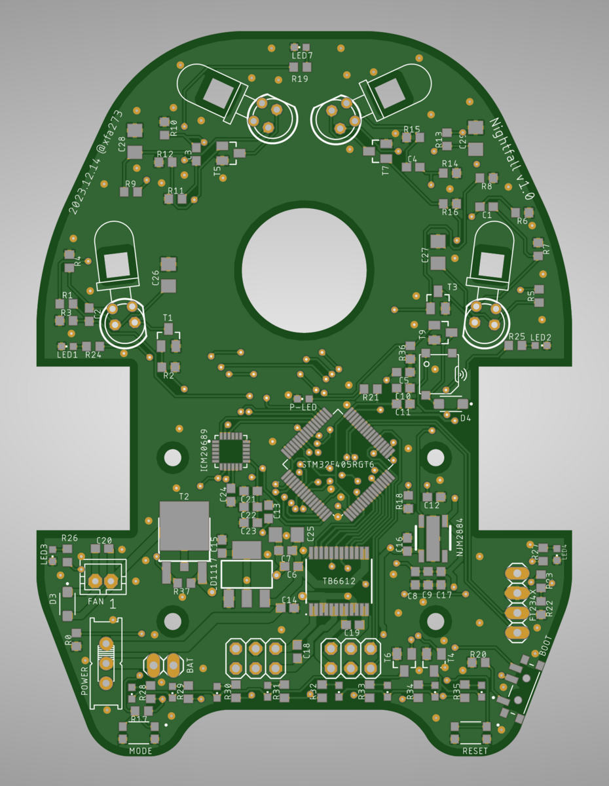

今年の[アドベントカレンダー](https://d.hatena.ne.jp/keyword/%A5%A2%A5%C9%A5%D9%A5%F3%A5%C8%A5%AB%A5%EC%A5%F3%A5%C0%A1%BC)は枠を埋めるために3記事も書きましたが，その分クオリティも薄まった感じになってしまった気がします．来年はちゃんと枠が埋まるくらいにみんな記事を書いてくれると嬉しいなぁ...
