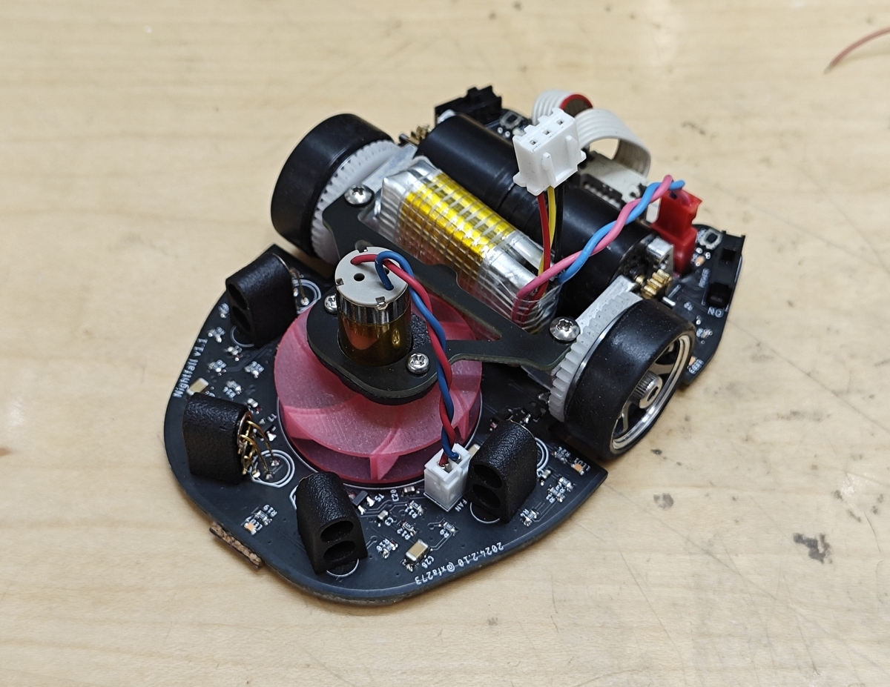

# クラシックサイズDCマイクロマウス"Nightfall"のパーツ紹介

2023年度シーズンは学生大会まで"Ca.161/bis"を作っていて，この機体の紹介は

[xfa273-backofchirashi.hatenablog.com](https://xfa273-backofchirashi.hatenablog.com/entry/2023/12/19/151923)でしました．

その後いろいろと不満点が出てきたので新作"Nightfall"を作って現在開発中な訳ですが，喜ばしいことに弊サークルWMMCでは初めてDCマウスを作ろうという2~3年生と[修士](https://d.hatena.ne.jp/keyword/%BD%A4%BB%CE)2年生が何人かいるようです．もちろん質問・相談など大歓迎ですが，共通のことをいちいち答えるのも面倒なので，主に部品構成と購入先をリストアップしておきます．

[NHK](https://d.hatena.ne.jp/keyword/NHK)[ロボコン](https://d.hatena.ne.jp/keyword/%A5%ED%A5%DC%A5%B3%A5%F3)と掛け持ちの人々は取り敢えず向こう頑張ってもらって，終わってマイクロマウスもやろうかなってなったらぜひDCマウスを作りましょう．

この機体の性能についてはソフト面が不十分で何とも言えませんが，少なくとも前作よりは走れそうで，強力な吸引力を考えれば「学生で上位に入る1717モータ搭載機」ぐらいまでは目指せるレベルだと思います．軽量化を諦めて強度全振りの設計なので最後の一歩は負けそうですが...

オリジナリティを追求するより無難な構成で手っ取り早くそれなりに速い機体を作りたいという人はぜひ参考にしてもらえたらと思います．（ちなみに丸パクリも許容です）

予算が気になる人も多いと思うので値段の目安も書いておきますが，機体の構成や買う店しだいで変わるのであくまで参考程度に．ケチるなら中華通販を積極的に使おう

足回りについては別に記事を書いたので，こちらを参照してください．

[xfa273-backofchirashi.hatenablog.com](https://xfa273-backofchirashi.hatenablog.com/entry/2024/05/09/025442)

### メカ

#### モーターとエンコーダ

Faulhaber 1717T003SR+IEH2-4096  ¥13,000~20,000 x2個

個人で買うなら割高ですがアールティ，サークルでまとめ買いするなら代理店の新光電子で学割と数割を使うのが良さそう．

<https://www.rt-shop.jp/index.php?main_page=product_info&products_id=3683>

#### ギヤホイール

アライさんの記事を参考に

<https://amac-araisan.blogspot.com/2018/09/blog-post_17.html?m=1>

**ミニッツ用ホイール**  ミニッツ [アルミホイール](https://d.hatena.ne.jp/keyword/%A5%A2%A5%EB%A5%DF%A5%DB%A5%A4%A1%BC%A5%EB) [GM](https://d.hatena.ne.jp/keyword/GM)スポーク ナロー +2.0mm  ¥1100 x1~2セット

<https://www.super-rc.co.jp/rc/product/view?id=23611>

**タイヤ** ミニッツ ローハイトスリックタイヤ MZW39-40  x1~2セット

幅がナローのものなら何でも良いですが，厚みや硬さで特性が変わります．自分は一番薄く，硬いものを使っています．

<https://amzn.asia/d/fVtMkM0>

**ホイール側のギヤ**  ミスミCナビ ポリアセタール M0.5 42T t2.0 内径8 ¥1,300 x2~4個
型番 GEBA-JW-A0.5-G42-P8-B2

<https://cp.misumi.jp/?utm_source=Ecatalog&utm_medium=banner&utm_content=Top-service_cnavi?bid=bid_Top-service_top_c1_sc3351_20211&_ga=2.264879757.387907512.1713022168-789331022.1680946136>

**ベアリング**  SMR63ZZ  ¥250 x4~8個

<https://jp.misumi-ec.com/vona2/detail/221000531116/?ProductCode=SMR63ZZ>

**シャフト用のねじ**  六角穴付きボルトM3x12 長さは設計しだい

<https://ja.aliexpress.com/item/4000186178344.html?spm=a2g0o.order_detail.order_detail_item.3.36011691ZslDW0&gatewayAdapt=glo2jpn>

#### ピニオンギヤ

KKPMO  M0.5 13T t1.5 内径1.5  ¥900 x2個

<https://shop.kkpmo.com/index.php?language=en&XTCsid=u5ijrp0rk62hk1j03q8r172204&=&XTCsid=u5ijrp0rk62hk1j03q8r172204>

#### モータマウント

設計しだいだけど¥5,000ぐらい

設計しだいですが，自分はCNC切削のアルミで作ったので，JLCPCBに発注しました．樹脂の3Dプリント部品で作る場合でもJLCPCBは安いのでおすすめです．（MJFのナイロンが一般的，レジンでも良いが脆いかも）

<https://jlcpcb.com/>

#### 吸引ファン

DMM.make 3Dプリント 高精細アクリル  4個で¥7,000ぐらい

<https://make.dmm.com/print/personal/>

#### 吸引ファンモータ

1020コアレスモータ（普通は8520の方がおすすめ） ¥400

<https://ja.aliexpress.com/item/1005004925984006.html?spm=a2g0o.order_list.order_list_main.101.2321585aLq0Kts&gatewayAdapt=glo2jpn>

### エレキ

回路の構成はほぼ前作と同じなので詳細はそちらの記事を参照してください．ここでは主要部品のみリストアップしておきます．

#### [マイコン](https://d.hatena.ne.jp/keyword/%A5%DE%A5%A4%A5%B3%A5%F3)

STM32F405RGT6  ¥2,000ぐらいだけどWMMC会員は提供品を無料で使える

<https://akizukidenshi.com/catalog/g/g113219/>

#### 壁センサ

¥500 x4~6ぐらい

センサは赤外線LEDとフォト[トランジスタ](https://d.hatena.ne.jp/keyword/%A5%C8%A5%E9%A5%F3%A5%B8%A5%B9%A5%BF)の組み合わせで，
**LED: CL-1KL7**

<https://www.kashinoki.shop/?pid=170106943>

**フォト[トランジスタ](https://d.hatena.ne.jp/keyword/%A5%C8%A5%E9%A5%F3%A5%B8%A5%B9%A5%BF): ST-1KL3A**

<https://www.kashinoki.shop/?pid=127571098>

を使っています．LEDはSFH-4550が定番なのでそっちを使っても良いと思います．

#### IMU（ジャイロ）

**ICM-20689**  ¥1,000ぐらいだけど海外通販しかないので送料がかかる，みんなでまとめて買いたいね．

<https://www.mouser.jp/ProductDetail/TDK-InvenSense/ICM-20689?qs=u4fy%2FsgLU9NcfLrncAE%252BeQ%3D%3D>

#### ブザー

**SMT-0540-S-R**  ¥400

特に主要部品ではないものの，小さいブザーは国内で買いにくいのでIMUと一緒に買っておくと良いです．

<https://www.mouser.jp/ProductDetail/PUI-Audio/SMT-0540-S-R?qs=e16JbV5WBEu5VaDVzQP23Q%3D%3D>

#### モータドライバ

1つのICで2つのモータを駆動でき，他によく使われるDRV8835に比べてはんだ付けが楽で使いやすいです．

**TB6612**  ¥200

<https://akizukidenshi.com/catalog/g/g111317>

#### チップ抵抗・[コンデンサ](https://d.hatena.ne.jp/keyword/%A5%B3%A5%F3%A5%C7%A5%F3%A5%B5)

チップ部品は秋月や千石，マルツでも売っているものの，使うもの全てを揃えるのは面倒なので，[Amazon](https://d.hatena.ne.jp/keyword/Amazon)やアリエクで売っている安いセットを買うと便利です．ぴったり合う定数の無くても近いやつで大抵動くしね

<https://amzn.asia/d/gJgKTWH>

<https://amzn.asia/d/0CvIxI7>

ちなみにチップ部品のサイズはmm表記とインチ表記があるので間違えないように注意．クラシックマウスなら1608M（メトリック，mm表記）が無難だと思います．

↓参考

<https://www.rohm.co.jp/electronics-basics/resistors/r_what6>

#### バッテリー

ドローン用の単セルLi-Poを2セルにパッキングして使っています．502030と呼ばれるサイズで，単セルで厚さ5mm，短辺20mm，長辺30mmです．[Amazon](https://d.hatena.ne.jp/keyword/Amazon)で売っているEEMB/EM3とかいうブランドのものを使っていますが，アリエクならもっと安く買えると思います．

単セルLi-Poを使うと好きなサイズのLi-Poを選びやすいので，機体設計の自由度とバッテリーの人権を両立させやすいので，Li-Poの扱い中級者以上には割とお勧めです．

<https://amzn.asia/d/3d74OLW>

取り敢えずで書いた記事なので，抜けや端折りの部分について知りたい方はDiscordなりTwiterなりで聞いてください．あと，足回りの組み方の記事は後日書く予定です．

では．
