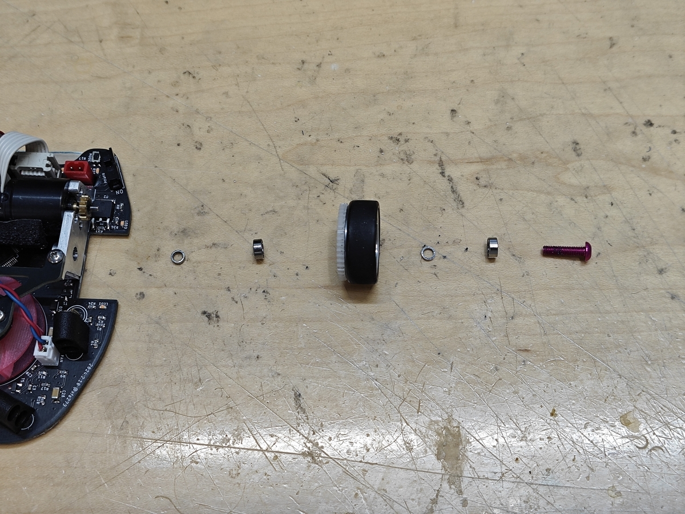
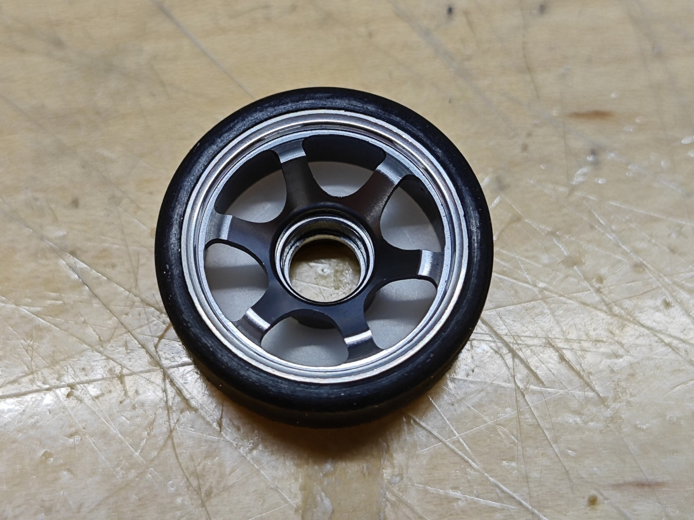
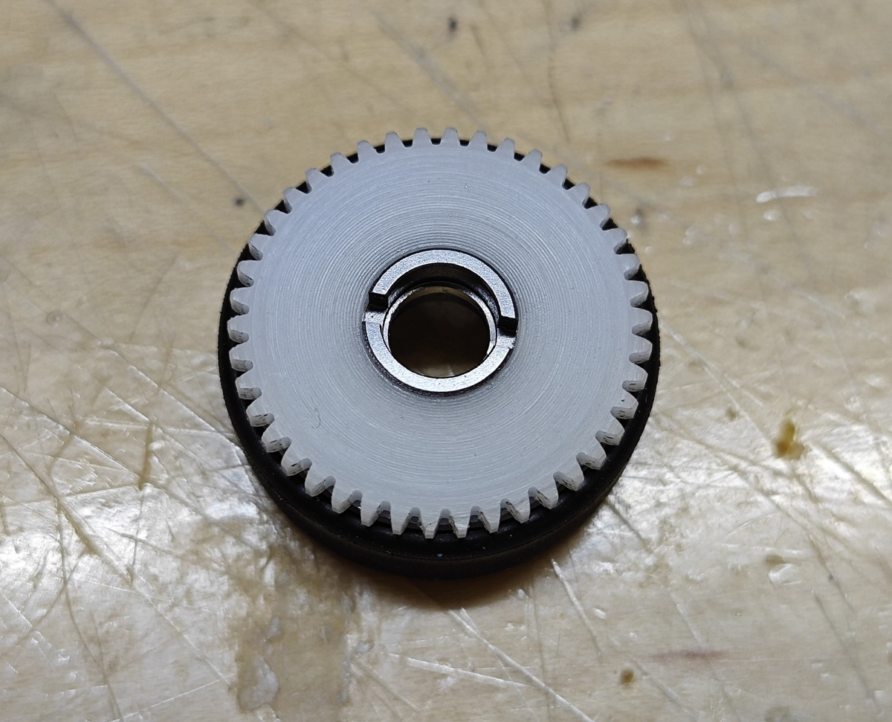
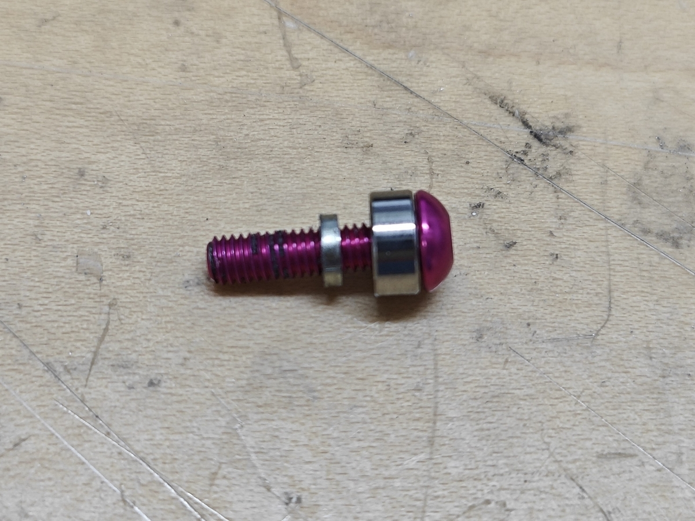
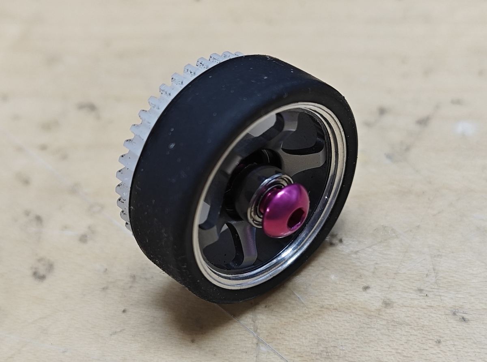
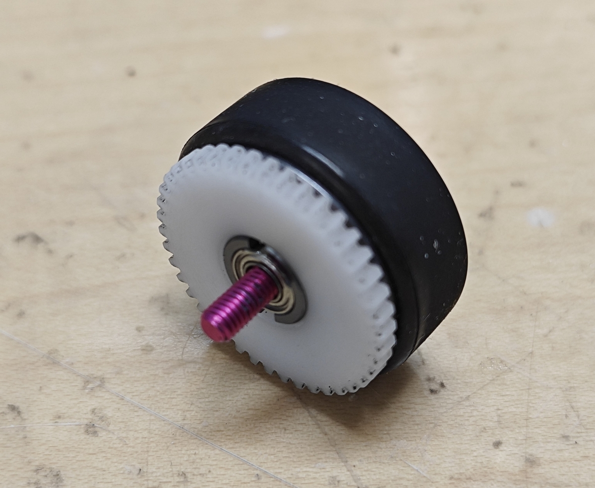
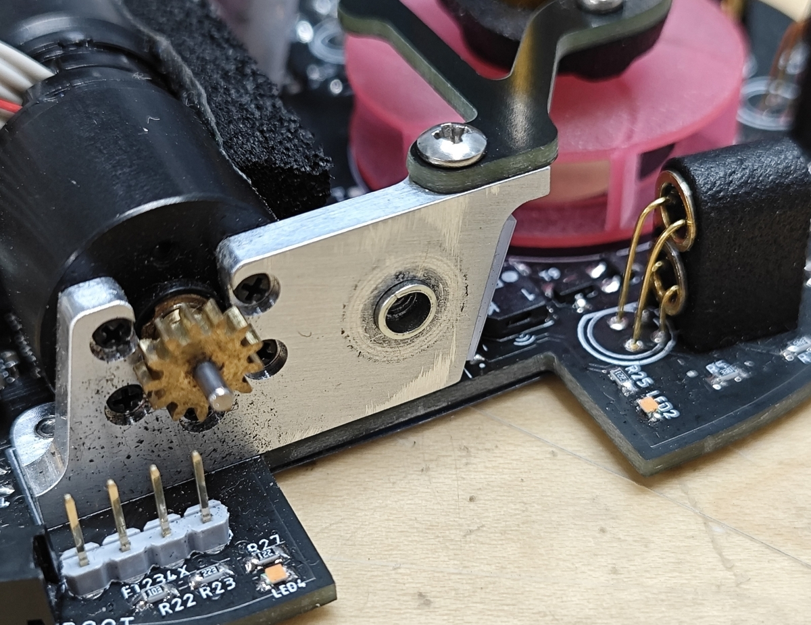
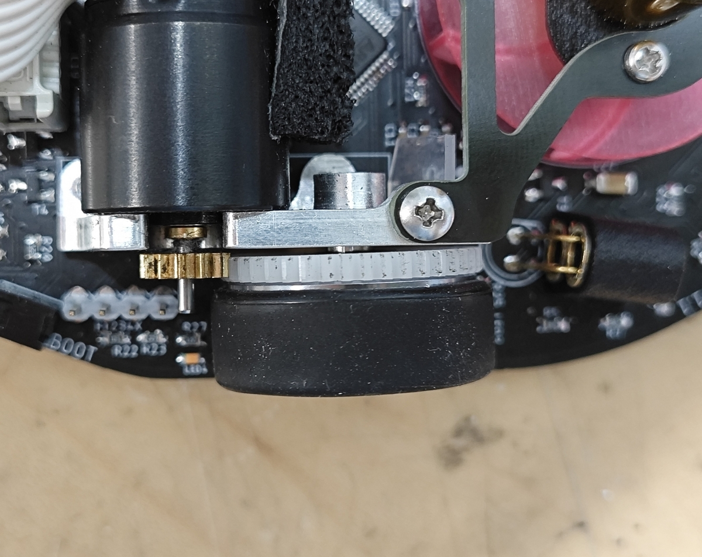
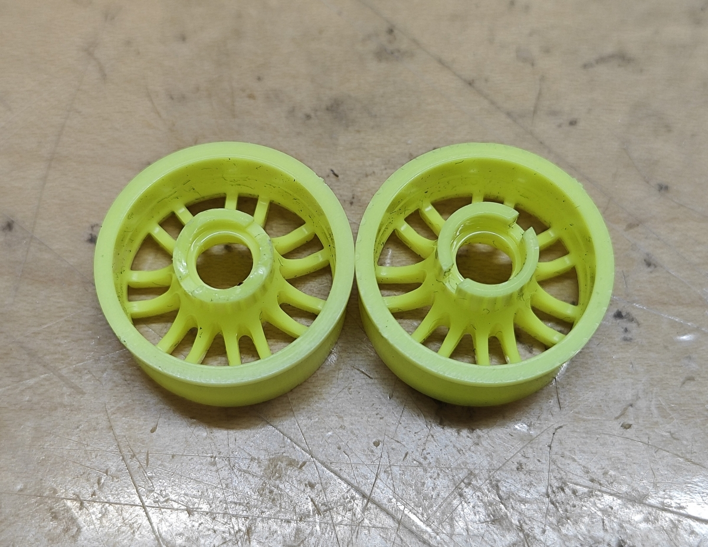

# 【既製品で作る】クラシックサイズDCマイクロマウスの足回り

DCマウスを作るとき，ハード面で一番難しいのは足回りだと思います．
見た目がそれっぽくても，上手く作らないと回転が渋くなったりまっすぐ走らなかったりしがちです．

既製品の組み合わせで良い感じの足回りができたので紹介します．

**参考**

[アライさんの小屋: ギヤホイールの作り方](https://amac-araisan.blogspot.com/2018/09/blog-post_17.html?m=1)

### 使う部品

個数は2輪と4輪で変わります．
ミスミは事業者しか使えないってことになっているものの，適当な事業者を名乗って登録すれば普通に使えるはずです．〇〇商会とか△△ロボティクスとか...

**・ホイール**
ミニッツ アルミホイール GMスポーク ナロー +2.0mm(2個入) [OP8-229]  x1~2セット

<https://www.super-rc.co.jp/rc/product/view?id=23611>

**・タイヤ**

ミニッツ ローハイトスリックタイヤ MZW39-40   x1~2セット

幅がナローのものなら何でも良いですが，厚みや硬さで特性が変わります．自分は一番薄く，硬いものを使っています．

<https://amzn.asia/d/fVtMkM0>

**・スパーギヤ**
ミスミCナビ ポリアセタール M0.5 42T t2.0 内径8  x2~4個
型番: GEBA-JW-A0.5-G42-P8-B2

<https://cp.misumi.jp/?utm_source=Ecatalog&utm_medium=banner&utm_content=Top-service_cnavi?bid=bid_Top-service_top_c1_sc3351_20211&_ga=2.264879757.387907512.1713022168-789331022.1680946136>

**・ベアリング**
SMR63ZZ  x4~8個

<https://jp.misumi-ec.com/vona2/detail/221000531116/?ProductCode=SMR63ZZ>

**・車軸**
六角穴付きボルトM3x12  長さはモータマウントの設計による  x2~4本
見た目のためにカラーアルマイトのものを使いましたが，別に何でも良いです．

<https://ja.aliexpress.com/item/4000186178344.html?spm=a2g0o.order_detail.order_detail_item.3.36011691ZslDW0&gatewayAdapt=glo2jpn>

**・スペーサー**
 スペーサー(鉄/三価ホワイト)(パック品) 呼びM3長さ1.6mm 1パック(50個)   x1パック

<https://www.monotaro.com/p/4226/4555/?t.q=%83X%83y%81%5B%83T%81%5B>

**・モーターマウント**  設計して外注or加工  x左右1個ずつ

### 使う工具

**・テーパリーマ**

<https://amzn.asia/d/hKMc9YU>

**・やすり（金属用の平たいもの）**

<https://amzn.asia/d/gjZ1gWO>

**・六角レンチorドライバ**（使うボルト/ねじに合わせる）

### モーターマウント

モーターマウントは各自の機体設計に合わせて設計しますが，
・車軸の固定部はM3めねじ
・車軸固定部に直径4.1mm，深さ1mmのざぐりがある
になるようにします．

ねじ切りが必要なので材質はアルミかPOMの切削がおすすめですが，3Dプリントで反対側にナットを埋め込んで代用でも良いと思います．

### 全体像

車体の外側から順に
モーターマウント←スペーサー(1.6mm)←ベアリング←ギヤ←ホイール←スペーサー(1mm)←ベアリング←ねじ
です．
ベアリングの内輪はスペーサー経由でモーターマウントに締め付けられて固定され，ベアリングの外輪がギヤホイールとともに回転します．

### 組立て

まず，ホイールの穴をテーパリーマで広げます．中の段差がギリギリなくならないぐらいまで削ります．

そして，ホイールのオフセット部分にスパーギヤをはめ込みます．

次に，スペーサーを長さ1.6mmから1mm（プラス公差）に削ります．モータマウントの軸受取り付け穴のざぐり部分にスペーサーをはめ込み，やすりでマウントの面とツライチになるまで削ると，ざぐり深さが1mmなのでスペーサーも1mmにすることができるはずです．ベアリング内輪を支えるために長さは1mmよりもわずかに長くなっていて欲しいので，1.08mmぐらいに調整するのが良さそうです．
出来上がったスペーサーは外して次の手順で使います．

そして，削ったスペーサーを使って，「ねじ-ベアリング-スペーサー」をホイールに差し込みます．

反対側にもベアリングをはめ込み，ねじを通します．

最後に，モーターマウントのざぐり部に今度は削っていないスペーサーをはめ込んでから，組立てたギヤホイールをねじで固定します．スペーサーの長さが上手く出来ていれば，強く締め付けてもホイールの回転は滑らかなままのはずなので，壊さない程度に力いっぱい締め付けます．

これで完成です．

**以下補足．**

ホイールは樹脂製のものでも良いですが，ホイールとギヤをはめ込む部分に強い負荷がかかったときに割れてしまうことがありました．普通に走らせている分には起きない気もしますが，安心のためにはアルミホイールをお勧めしておきます．
樹脂製を使う場合は
MZH131W-N2

<https://amzn.asia/d/ch9RrYk>

←割れちゃったやつ

