# 2024シーズンの機体紹介

- 公開日（移行元）: `2024-12-26`
- 移行元記事: https://xfa273-backofchirashi.hatenablog.com/entry/2024/12/26/225736

## お詫び

東日本大会前の限界開発により力尽き，そして修論の発注を急いでいたため，投稿が間に合いませんでした．大変申し訳ありません．

これはマイクロマウスAdvent Calendar2024の22日目のはずだった記事です．

- Advent Calendar: https://adventar.org/calendars/9933
- 昨日の記事: [「マイクロマウｽﾀｯｸﾁｬﾝハーフ化計画」](https://yuki-maelstrom.hatenablog.com/entry/2024/12/21/060503)

今シーズンは去年12月に作った旧作 `Nightfall` に加え，新作クラシックマウス `Nightfall-Lite` と（ほぼ）初めて作ったマイクロマウス `CyberRat` を製作し，大会に出場していました．どちらもそれなりに走るようになったので，これから機体を作る人の参考になればと思います．

## クラシックマウス "Nightfall-Lite"

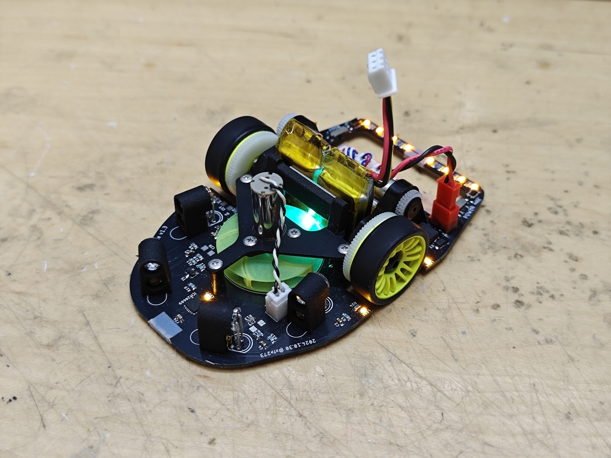

**Nightfall-Lite 全体像**

### 戦績

- 九州地区大会: `9'538` **優勝**
- 学生大会: `4'052` **2位**
- 東日本地区大会: `5'835` 4位

### 概要

前作 `Nightfall` を軽量化してより速く走れるようにした新機体です．最近流行りの軽量低イナーシャな2輪機で，パーツ構成は全日本大会で上位だった ["XM-702 Carmine"](https://b4rracud4.hatenadiary.jp/entry/20240221/1708511889)，全体的な機体の作りは ["雪風8AS"](http://4th-laboratory.cocolog-nifty.com/diary/2024/02/post-bec085.html) を参考にしています．回路は前作からほぼ変更しておらず，前作のソフトがほぼそのまま使えます．

まだ斜め走行ができておらず大回りのみでこのタイムと順位なので，機体性能としてはそれなりに高く作れたのかなと思います．~~斜め出来ないようなやつが入賞してしまうとは，やはり時代はハーフマウス...~~

現状のそれなりに走れる最高パラメータは以下です．

- 直進最高速度: `5.0m/s`
- 直進加速度: `28.0m/s^2`
- 小回りターン: `1.4m/s`
- 大回りターン: `2.2m/s`

学生大会の最速タイムはこれだったはずです．

### 基板

へえ，こんなんで動くんだ...（適当）

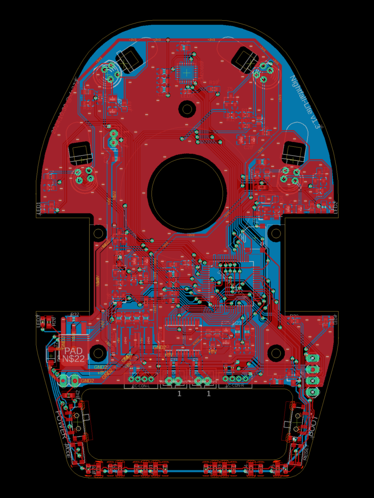

**Nightfall-Lite 基板（表）**

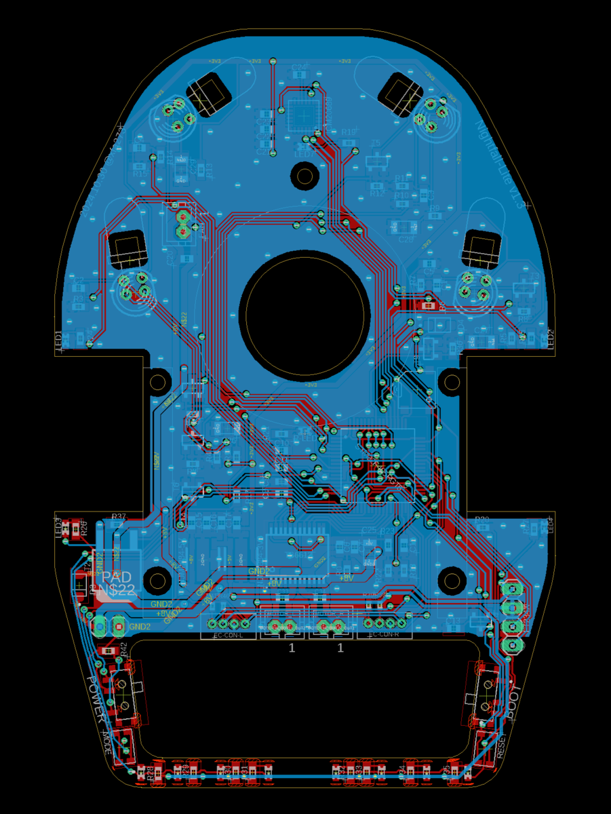

**Nightfall-Lite 基板（裏）**

### モーターマウント

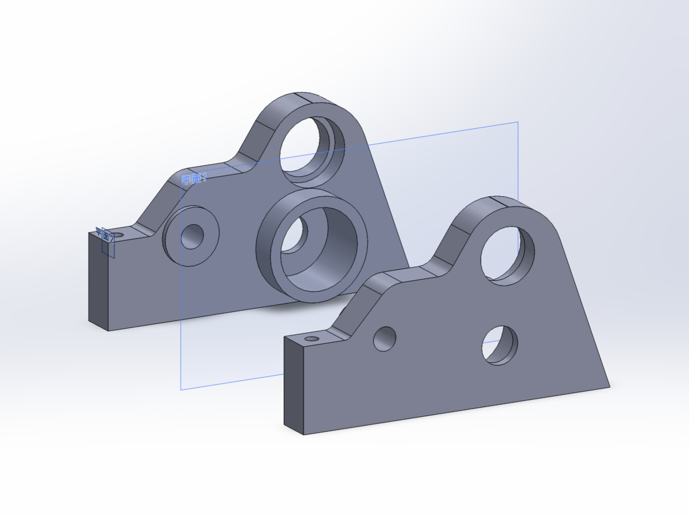

**Nightfall-Lite モーターマウント**

雪風のものを参考に設計し，JLCPCBのPOM切削で発注しました．ミスミMeviyと比べて仕上がりの個体差は大きいものの，より細かく複雑な形状まで対応してくれるので，マウスの部品を作るのには使いやすいと思います．左右合わせて `$45` ぐらいでした（為替レートの影響で予備機の方が少し高い）．

モーターはカプトンテープを巻いてキツさを調整しながら押し込んで固定，エンコーダはそのまま押し込んで固定しています．ホイール軸，基板，ファンマウントの固定はM2/M3の下穴をあけるように発注し，手動でタップを切りました．固定用なら問題ありませんが，ホイール軸はタップ切りを上手くやらないと傾くので，他の方法を考えた方が良いかもしれません．

### モーター

8520サイズで，[AliExpressで購入](https://ja.aliexpress.com/item/1005005530264040.html?spm=a2g0o.order_list.order_list_main.38.7aac585adHq5Al&gatewayAdapt=glo2jpn) したものです．理論的なモーター選定は行っていませんが，以下3点を考慮して選びました（個体の選別は未実施）．

- 定格7.4V: 電流が流れすぎなくて使いやすそう
- ギヤを通して減速する用途: 高トルクを期待
- 軸方向の遊びが少ない: 機械的な作りの良さを期待

### ギヤ

`XM-702` と同じ構成です．バックラッシは `0.1mm` で設計し，特に問題なさそうです．

- モーター側: `M0.3 15T t2.0` 真鍮（KKPMO）
- ホイール側: `M0.3 71T t2.0` POM（ミスミCナビ）
- エンコーダ: `M0.3 29T t2.0` POM（ミスミCナビ）

エンコーダのギヤはミスミだと穴径の小さいものが買えないため，3Dプリント製スペーサーを挟んで使っています．

### ファン

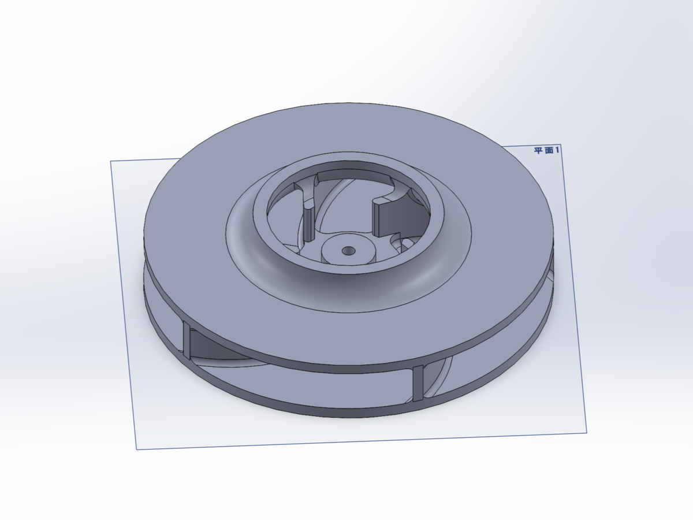

**Nightfall-Lite ファン**

直径30mm，高さ5mmで，DMM.makeの高精細アクリルで発注しました．基板のファン下部分に部品はありませんが，ダクト付き形状にすることで，クラッシュ時にファンの羽と基板が当たってファンが割れるのを防止しています．実際，フェイルセーフが上手く機能しない状態で吸引走行を行ってクラッシュしてもファンが割れることはありませんでした．

モーター軸との固定は圧入+接着剤（ロックタイト480）で，穴径はモーター軸径 `-0.03mm` にしています．

### ファンマウント

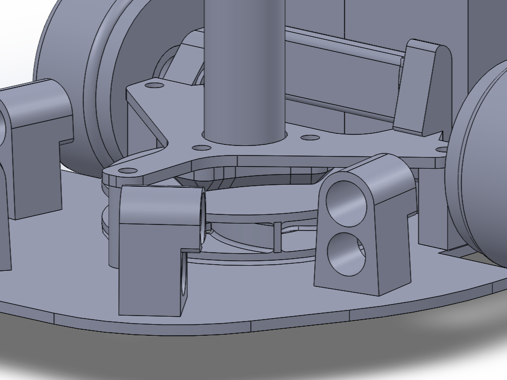

**Nightfall-Lite ファンマウント1**

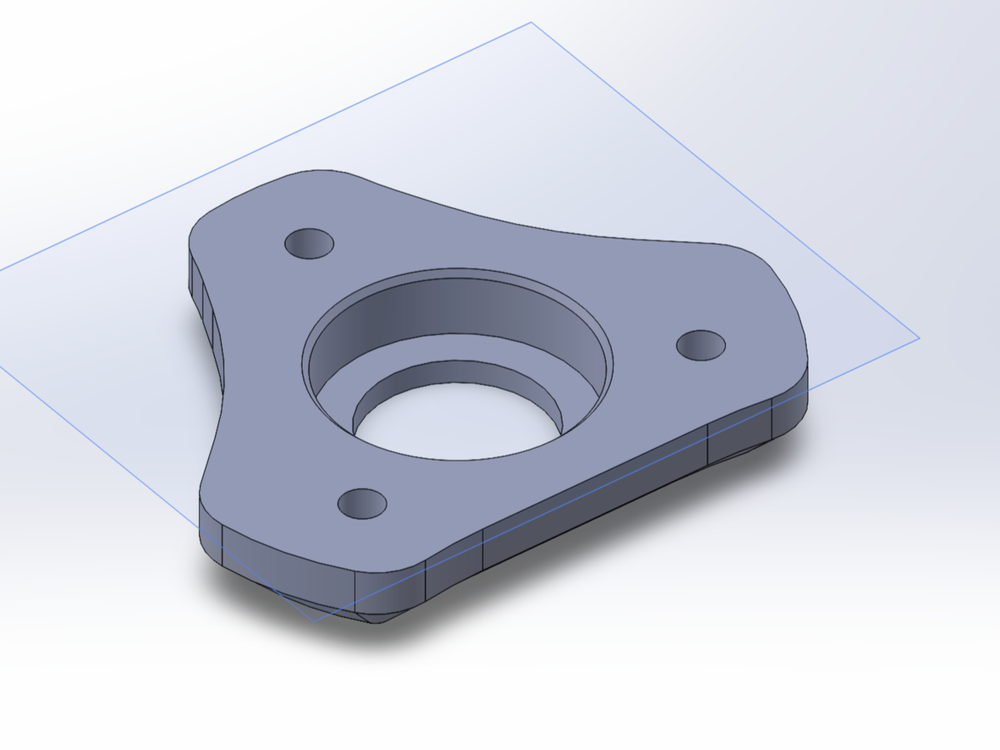

**Nightfall-Lite ファンマウント2**

`t1.2mm` のPCBと3Dプリント部品（MJF PA12）を組み合わせています．プリント部品には薄い底面（0.8mm）があるため，ファンモータが緩んで落ちることはありません．

モーターとプリント部品は接着（ロックタイト480）し，プリント部品とPCBはプリント部品に下穴をあけて発注してタップを切り，M2ねじでPCBに固定しています．また，PCBに別のプリント部品を接着し，これによってバッテリーを走行モーターとの間で挟み込んで固定しています．

## マイクロマウス（旧ハーフサイズ）"CyberRat"

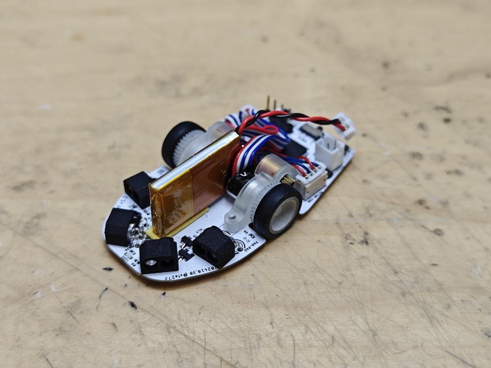

**CyberRat 全体像**

### 戦績

- 九州地区大会: `8'005` 11位
- 学生大会: `7'073` 8位
- 東日本地区大会: `9'042` 8位

### 概要

DCモータ搭載のマイクロマウスとしては初めて製作した機体です．ハーフサイズで多く使われている磁気式エンコーダは実用にするのに様々なノウハウが要ると聞くので，[既製品の光学式エンコーダ](http://www.piezon.co.jp/ecc/html/products/detail.php?product_id=6) を使うことでこれを回避して手っ取り早く走るようにしたいという狙いでした．

機体性能は大したことないので上位には入れませんが，毎回最短走行を成功させており，目標としていた「ちゃんと走るハーフマウス」にはなれたと思います．基板面積を広く取れる設計でクラシックマウスと同じマイコンを搭載しており，ほぼ共通のプログラムで走ることが出来ます（恐らく32x32だと探索が計算量オーバー）．

同様の既製品光学式エンコーダ搭載機として ["小天旋2 verMTL”](http://anikinonikki.cocolog-nifty.com/blog/2012/10/s-a467.html) を参考にしています．

## 基板

~~パスコンの置き方が終わってるけど意外と普通に動いた．~~

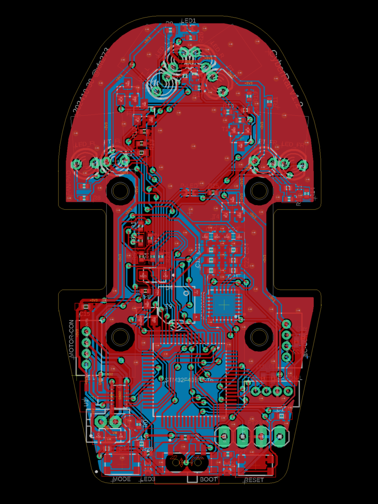

**CyberRat 基板（表）**

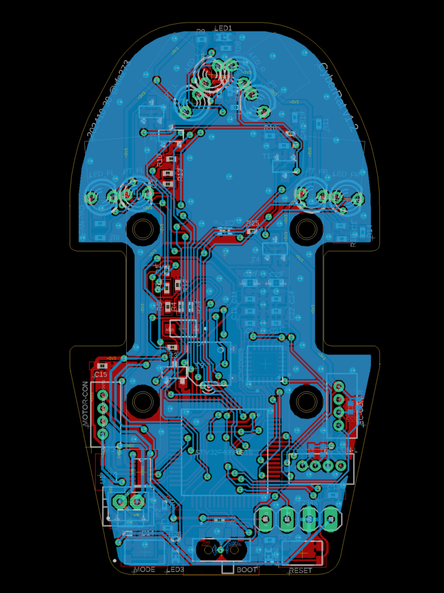

**CyberRat 基板（裏）**

### モーターマウント

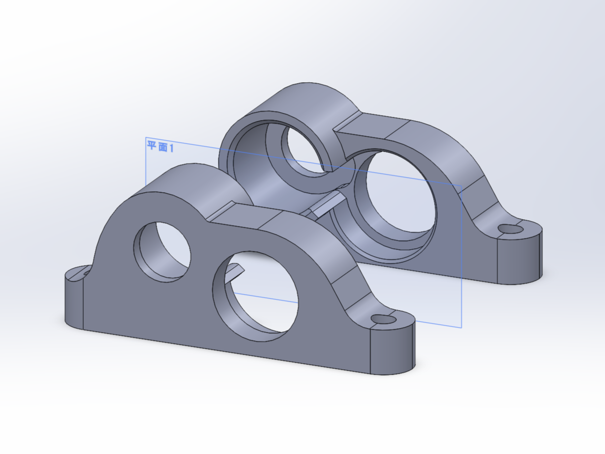

**CyberRat モーターマウント**

DMM.makeの高精細アクリルで作りました．クラシックと同様に，モーターはカプトンテープを巻いてキツさを調整しながら押し込んで固定，エンコーダはそのまま押し込んで固定しています．ネミコン7Sエンコーダ（やMTLの6mmのもの）は軸にベアリングが入っているので，エンコーダ軸に直接ホイールを差し込み，ホイールマウントを兼ねています．

### モーター

何となく機体幅が狭い方が走りやすくて良いかなという理由で [610サイズのアリエク謎モーター](https://ja.aliexpress.com/item/1005005211443718.html?spm=a2g0o.order_list.order_list_main.79.7aac585adHq5Al&gatewayAdapt=glo2jpn) を使いました．しかし，同仕様のはずなのに挙動の全然違うハズレモーターがあったり，そもそもトルク不足気味だったりするので，大人しくMk06などを使った方が良さそうです．

### ギヤ

- モーター側: `M0.3 9T t2.0` 真鍮（RTで販売）
- ホイール側: `M0.3 35T t2.0` POM（ミスミCナビで発注）

今なら [Zilconia v2用のギヤがRTで販売](https://www.rt-shop.jp/index.php?main_page=index&cPath=1002_1024_1283) されているので，それを使うのが良い気がします．

## まとめ

という感じで，今シーズンの機体紹介でした．シーズンとしては全日本大会が残っていますが，去年と違って流石にもう新しい機体は作らない予定です（多少の改修はするかもしれません）．

明日（もうとっくに数日前）の記事はエアプ回路レビュワーさんの [「小容量・小型LiPoバッテリーの研究とスポット溶接」](https://qiita.com/tanutanup/items/c2a9711e5febdee0d3cf?utm_campaign=post_article&utm_medium=twitter&utm_source=twitter_share) です．自分も初めてハーフマウスを作ってLi-Po選びが難しいと感じたので，参考にしたいと思います．
