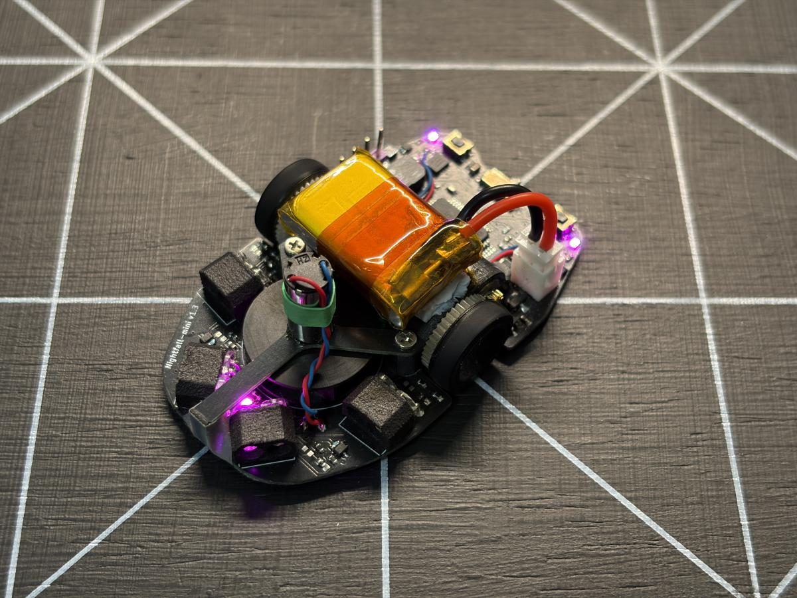

# 今年のマイクロマウス振り返り

これはマイクロマウス[アドベントカレンダー](https://d.hatena.ne.jp/keyword/%A5%A2%A5%C9%A5%D9%A5%F3%A5%C8%A5%AB%A5%EC%A5%F3%A5%C0%A1%BC)2025の14日目の記事です．

[マイクロマウス Advent Calendar 2025 - Adventar](https://adventar.org/calendars/12206)

昨日の記事はロングシリーズさんの"今年の新型機について"でした．新入社員ですら開発の時間が減ったなぁという感じなのに、さらに子育てもしながら新作を2台も作るとは... 持続可能な社会人マウサーのお手本として参考にしたいと思います．（むしろ参考にしてはいけない？普通は無理では？？

まともに書いた前回の記事は去年の[アドベントカレンダー](https://d.hatena.ne.jp/keyword/%A5%A2%A5%C9%A5%D9%A5%F3%A5%C8%A5%AB%A5%EC%A5%F3%A5%C0%A1%BC)になってしまった，xfa273です．今年から北九州の某電機機器メーカーに入社したので，地方移住した新社会人のマウス開発がどんな感じだったか振り返りたいと思います．

### 開発環境構築

#### ハード編

> My New 寮… [pic.twitter.com/hhgdiEeaw2](https://t.co/hhgdiEeaw2)
>
> — xfa273 (@xfa273) [2025年3月31日](https://twitter.com/xfa273/status/1906607231778578519?ref_src=twsrc%5Etfw)

弊社は新入社員は全員寮に入るので，こんな感じの部屋に住んでいます．最初は何もありませんでしたが，散財の限りを尽くし，デスク環境を整えました．31インチ4Kモニタと18インチの縦モニタ（モバイルモニタ流用）で複数ウインドウでも快適です．

> デュアルモニタ設置した
> 4K 31.5" + FHD 18.3" [pic.twitter.com/AjMdtkNDAh](https://t.co/AjMdtkNDAh)
>
> — xfa273 (@xfa273) [2025年9月23日](https://twitter.com/xfa273/status/1970366754682740896?ref_src=twsrc%5Etfw)

・[32GS95UV 31.5" 4K240Hz](https://amzn.asia/d/beVk0Mp)
・[InnoView 18.5" FHD](https://amzn.asia/d/7Y8B2IQ)
・[BenQ ScreenBar Pro](https://amzn.asia/d/beVk0Mp)

> [マイコン](https://d.hatena.ne.jp/keyword/%A5%DE%A5%A4%A5%B3%A5%F3)在庫切れだったので取り敢えず剥がして確保
> ホットプレート便利だね [pic.twitter.com/RakiAoCrHP](https://t.co/RakiAoCrHP)
>
> — xfa273 (@xfa273) [2025年9月14日](https://twitter.com/xfa273/status/1967070217227694255?ref_src=twsrc%5Etfw)

寮の狭さからハーフサイズがメインになるので，裏面パッドの表面実装ができるようにはんだ付け用ホットプレートも買いました．これで4000dps対応IMU ISM330DHCXも無事付けられました．
・[ALIENTEK HP15](https://ja.aliexpress.com/item/1005008093053677.html?channel=twinner)

> 九州大会前のマウスはここまで
> 壁切れを追加したおかげで距離ズレする無茶な加速度でも割と走れるようになった [pic.twitter.com/9d5RNjIVNr](https://t.co/9d5RNjIVNr)
>
> — xfa273 (@xfa273) [2025年10月20日](https://twitter.com/xfa273/status/1980257667148104147?ref_src=twsrc%5Etfw)

そして当然9x9迷路も購入．板は穴あけまで外注して学生のうちに自分で塗ったものですが，壁柱だけで5万円ぐらいかかりました．3Dプリント製の壁柱でも普通に走れますが，[しきい値](https://d.hatena.ne.jp/keyword/%A4%B7%A4%AD%A4%A4%C3%CD)の調整などが大会と合わなくなるので，ちゃんと競技やろうと思ったら大人しく買ったほうが良いと思います．

#### ソフト編

> アドカレ用に振り返り
> Windsurf 使用状況 [pic.twitter.com/n9rAjKVXYo](https://t.co/n9rAjKVXYo)
>
> — xfa273 (@xfa273) [2025年12月13日](https://twitter.com/xfa273/status/1999849719762416072?ref_src=twsrc%5Etfw)

まず，最近流行りのAIコーディングを本格的に始めました．色んなツールがありますが，ソフト初心者向けってどこかで見かけたWindsurfを使っています．土日メインでマウス開発なら月$15ぐらいのプランでThinking付きモデルをがっつり使っても大体足りるみたいです．

[Referrals | Windsurf](https://windsurf.com/refer?referral_code=ox6uaybj3yxyfn5u)

> ログ取り用にAIに作らせたツール
> これで[Excel](https://d.hatena.ne.jp/keyword/Excel)脱却 [pic.twitter.com/zqnykrYMX4](https://t.co/zqnykrYMX4)
>
> — xfa273 (@xfa273) [2025年12月13日](https://twitter.com/xfa273/status/1999851936074666416?ref_src=twsrc%5Etfw)

そしてこのAIたちに作ってもらって良かったのがログ取得＆描画ツール．予め決めておいたフォーマットのログデータをUARTで受信すると自動的に[CSV](https://d.hatena.ne.jp/keyword/CSV)ファイルで保存し，それを描画ツールからダブルクリックだけで表示できます．本当は[SRAM](https://d.hatena.ne.jp/keyword/SRAM)を積むとかしてもっと沢山ログを取りたいですが，普通にRAMに収まる範囲のログ取りならこれで用が足りそうです．これで学生ライセンスがなくなって[Excel](https://d.hatena.ne.jp/keyword/Excel)使えなくてもやっていける...

### 機体紹介

今シーズン製作したハーフサイズマイクロマウスが"Nightfall-mini"です．設計は学生のうちに行いましたが，引っ越し前々日ぐらいに部品が届いたので，製作は全て社会人になってからです．3機目のハーフマウス，2機目のDCハーフマウス，初めての吸引ハーフマウスです．

**<コンセプト>**
前作"CyberRat"の部品構成を引き継いで無難に動かしつつ，大電流の構成によりそれなりに速くする．

既成品のネミコン7Sエンコーダを使った足回りやクラシックから流用し続けているSTM32F405RGTは続投し，バッテリーも無難に1セルです．しかしそれだけでは面白くないし戦えないので，
IMU: ISM330DHCX 4000dps対応
MD: MP6551 最大5A対応
モータ: NFP-D0612-2-3.4 みんな使ってるモータの1.7Ω版
バッテリ: [Palm Beach](https://d.hatena.ne.jp/keyword/Palm%20Beach) Bots 100/180mAh 45C
を採用しています．

最近はPOWERが全てとか言われていますが，POWERとは電力なので，1セルでも大電流を流せればPOWERを手に入れられるはずです．まだ安定していませんが，ターン速度1.4m/s，加速度18m/ss，吸引力100g，程度を発揮できるようです．これは1セル機としては強い方ではないかと思います．

大電流を流せるバッテリはChatGPT（5 Thinking）に聞いたところ[Palm Beach](https://d.hatena.ne.jp/keyword/Palm%20Beach)のが良さそうとのことだったので，送料を9,000円ぐらい払ってフロリダから購入しました．モータも1.7Ω版はNFP公式から買って，結局2.5万円ぐらい使ってしまいました．まだそんなに社会人パワーないのに...

・[Palm Beach Bots Li-Po](https://palmbeachbots.com/products/palm-power-2s-100mah-45c-lipo-battery)
・[NFP-D0612](https://nfpshop.com/product/6mm-coreless-motor-high-speed-low-current?srsltid=AfmBOoobms5y1rmxkS3yfLPGHCmOpW_iBEXL1oHp0uhPDKruz6n7D804)

といったところで，0時を回ってしまったので，ここまでとします．機体情報など，もっと知りたいことがあればコメント貰えれば追記したいと思います．

明日はコヒロさんの「[C++](https://d.hatena.ne.jp/keyword/C%2B%2B)に乗り換えた話」です．マウスのコードを[C++](https://d.hatena.ne.jp/keyword/C%2B%2B)に変えた/変えたいという話はよく聞く気がしますが，実際どうなんでしょう？お楽しみに．
