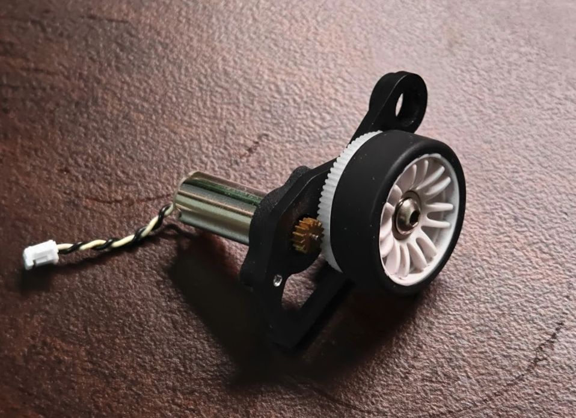
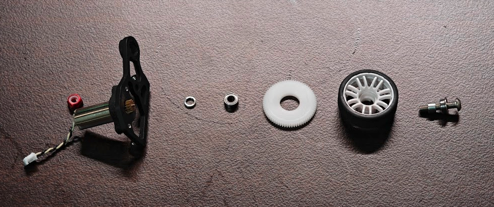
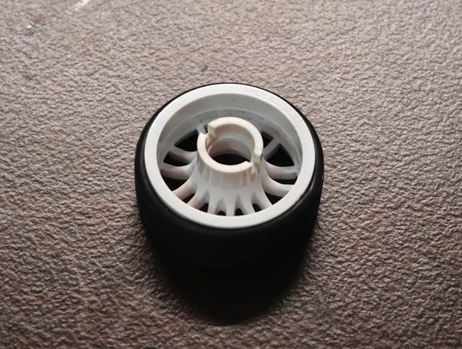
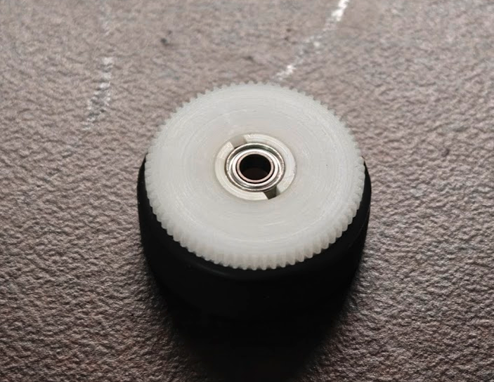
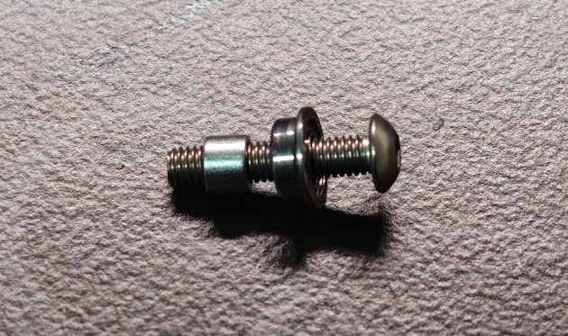
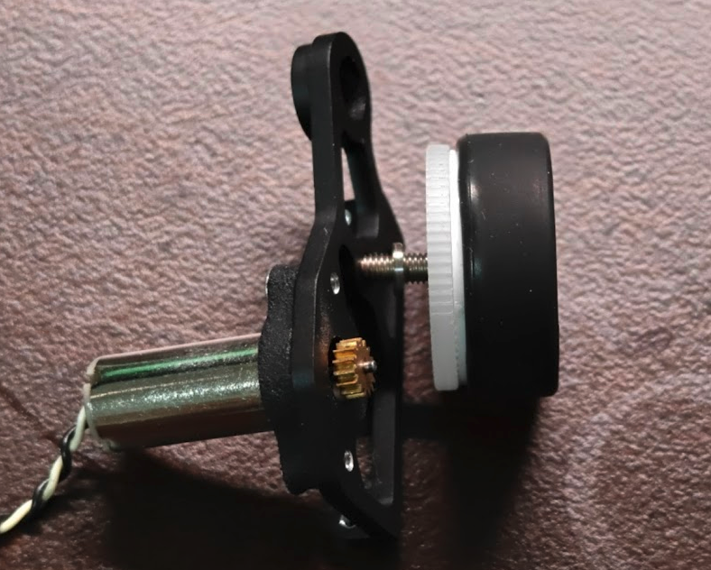
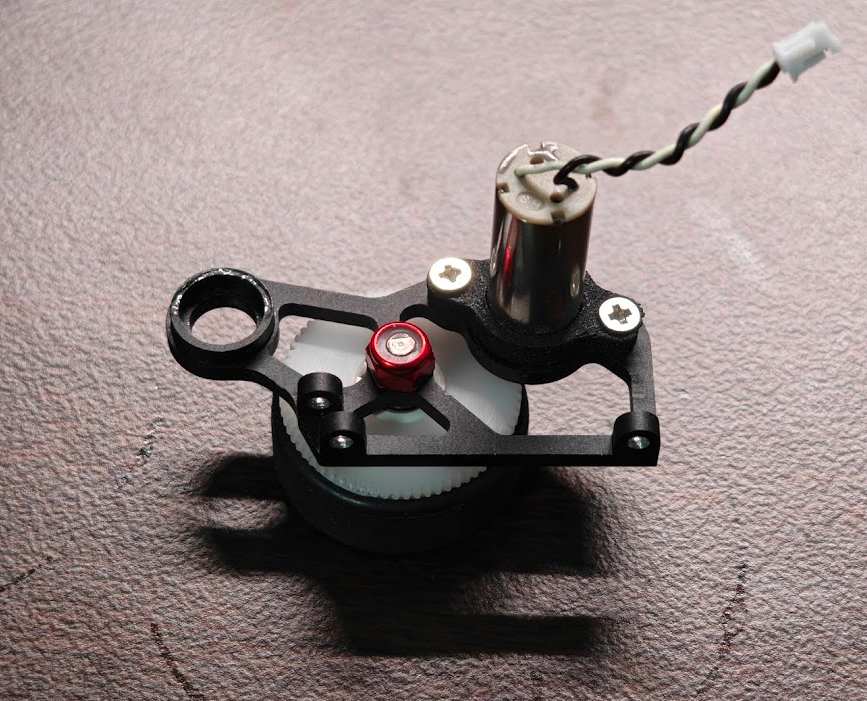

# 【改良版】既製品で作るクラシックサイズDCマイクロマウスの足回り

以前の記事でミニッツ用アルミホイールを使ったギヤホイールの作り方を紹介しましたが，

- 鉄スペーサを手で削って寸法を調整する必要がある
- アルミホイールの入手性が良くない
- ギヤとホイールを接着しないと滑ることがある

といった問題がありました．

ここではアルミホイールと比べると少し強度が落ちるものの，より簡単に作れて使いやすい足回りの構成を紹介します．

**この記事で作る足回り**

以前の記事で樹脂ホイールが割れるという話をしましたが，その後は一度も壊れておらず，よほど激しくぶつけなければ大丈夫だと思います．

割れた時の機体が1.6mm基板とアルミモータマウントで頑丈過ぎただけで，普通の機体構成なら先に他が壊れるはず…
この樹脂ホイールは染色液で煮れば好みの色にできるというおまけメリットもあります．

# 使う部品
基本的に2輪で作る場合の個数を記載します．4輪にする場合はピニオンギヤ以外を倍の個数準備してください． 
※Amazonアソシエイトリンクを使用しています．記事が役に立ったと思ったら，リンク経由でお買い物していただけると筆者が喜びます．

- **ホイール** 
微妙に違う型番のものが多数あるので注意．間違えるとギヤやベアリングが上手くはまりません． 
[ミニッツ マルチホイールⅡナロー/オフセット2.0 MZH131W-N2B x1セット](https://amzn.to/4694vAc)

- **タイヤ** 
ミニッツ用のナロータイヤなら何でも良いです．吸引機では30~40度の硬め，非吸引機では20度の柔らかめがおすすめです． 
[ミニッツ ローハイトスリックタイヤ MZW39-40 x1セット](https://amzn.to/4apk09B)

- **スパーギヤ** 
ミスミが使えない人はアライさんの記事を参考にタミヤの部品を使うか，KKPMOなどで同パラメータのものを発注してください．
適当な事業者を名乗って登録すれば普通に使えると思いますが…．〇〇商会とか△△ロボティクスとか． 
[ミスミCナビ ポリアセタール M0.5 42T t2.0 内径8 x2個](https://cp.misumi.jp/?utm_source=Ecatalog&utm_medium=banner&utm_content=Top-service_cnavi?bid=bid_Top-service_top_c1_sc3351_20211&_ga=2.264879757.387907512.1713022168-789331022.1680946136) 
もしくは [M0.3 71T t2.0 内径8 x2個](https://cp.misumi.jp/?utm_source=Ecatalog&utm_medium=banner&utm_content=Top-service_cnavi?bid=bid_Top-service_top_c1_sc3351_20211&_ga=2.264879757.387907512.1713022168-789331022.1680946136)

- **ベアリング** 
同じサイズで片方は通常のもの，もう片方はフランジ付きです． 
[SMR63ZZ x2個](https://amzn.to/4q5a5uv) 
[SMF63ZZ x2個](https://amzn.to/4qTNPVQ)

- **車軸** 
材質や色はお好みで．ボタン頭のものがコンパクトでおすすめです． 
[六角穴付きボルトM3x12  長さはモータマウントの設計による x2本](https://amzn.to/4ansoqe)

- **ナイロンロックナット** 
普通のナットでも良いですが，緩んでこないロックナットがおすすめです． 
[https://amzn.to/3LUxGAd](https://amzn.to/3LUxGAd)

- **スペーサ（ホイール内）** 
今回は削らずにそのまま使います． 
[スペーサー(鉄/三価ホワイト)(パック品) 呼びM3長さ2.5mm 1パック(50個)   x1パック](https://www.monotaro.com/p/4226/4573/?t.q=スペーサー(鉄/三価ホワイト)(パック品)+呼びM3長さ2.5mm)

- **スペーサ（モータマウント側）** 
機体設計によって変わりますが，1mmのものを使うと機体幅を最小にできます．材質によって面取りの形状が変わるようなので，アルミではなくステンレスを選んでください． 
[ベアリング用スペーサ 内輪用 CLBPS3-5-1 x2個](https://jp.misumi-ec.com/vona2/detail/110302644450/?KWSearch=スペーサー+ベアリング&searchFlow=results2products&searchCategorySpec=00)

# 使う工具
- **テーパリーマ** 
今回は樹脂ホイールなので，ラジオペンチのフチなどでも代用できます． 
[テーパリーマ](https://amzn.to/3ZtYvhX)

- **六角レンチorドライバ** 
使うボルトやネジに合わせて． 
[たとえば六角レンチセット](https://amzn.to/4qdydeL)

# モータマウント
モータマウントは各自の機体設計によりますが，車軸の固定部はφ3の穴になるようにします．
CNC切削のPOMかアルミだと精度を出しやすいのでおすすめです．JLCCNCなら数千円で作れるはず．

# 全体像
車体の外側から順に 
ナイロンロックナット←モータマウント←スペーサ（1mm）←SMR63ZZ←スパーギヤ←ホイール←スペーサ（2.5mm）←SMF63ZZ←ボルト/ネジ 
です． 
ベアリングの内輪はスペーサー経由でモーターマウントに締め付けられて固定され，ベアリングの外輪がギヤホイールとともに回転します．

**足回りの構成**

# 組立て
まず，ホイールの穴をテーパリーマで広げます．中の段差がギリギリなくならないぐらいまで削ります．

**穴を広げたホイール**

次に，ホイールのオフセット部分にスパーギヤをはめ込み，そのあとホイール中央の穴にフランジがない方のベアリング（SMR63ZZ）をはめ込みます．これによって樹脂のホイールがわずかに外側に変形してギヤを押さえつけるようになり，接着しなくてもギヤとホイールが外れなくなります．

**ベアリングとギヤをはめ込んだホイール**

組立てたギヤホイールに外側から 
スペーサ（2.5mm）←フランジ付きベアリング（SMF63ZZ）←ボルト 
を差し込み，モータマウントとの間にスペーサ（1mm）を入れてモータマウントに取り付けます．モータマウントの裏側からナイロンロックナットで締め付けたら完成です．

**これをさっきのホイールに差し込む**

**モータマウントに取り付ける**

**裏側からナットで固定**

**完成**

